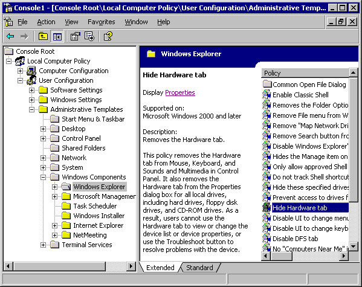

# Using the Extended View Extension

The Extended View extension snap-in is included with MMC 2.0. It is provided as a means of adding user interface elements to an existing view, creating a new view, and using the [MMC 2.0 Automation Object Model](mmc-2-0-automation-object-model.md).

The following illustration shows the Extended View in the Group Policy snap-in.



The Extended View extension snap-in provides a title bar for the result pane, and an HTML details area and description area for the selected result item. The title bar contains the icon and name of the selected scope node. Below the title bar, the right portion of the result pane contains the primary snap-in's list view (or OCX view or HTML view, depending on the scope node's choice of result pane view). The left portion of the result pane contains the name of the selected list item.

If the [**CCF\_HTML\_DETAILS**](ccf-html-details.md) property is supported, the HTML details area will display below the name of the selected result item. If the [**CCF\_DESCRIPTION**](ccf-description.md) property is supported, a description of the selected item will display below the HTML details area. If the HTML details area is not supported, the description will display below the name of the selected result item.

The HTML details area is controlled by the returned string for the CCF\_HTML\_DETAILS property; the returned string must be plain text. The HTML details area is provided so that user interface elements can be added to a view. Additionally, script can be invoked to use the [MMC 2.0 Automation Object Model](mmc-2-0-automation-object-model.md). For example, the following string (returned as the CCF\_HTML\_DETAILS property value) results in text and a link appearing in the HTML details area.


```VB
"Display <A HREF = javascript:external.ExecuteSelectionMenuItem('_PROPERTIES')>Properties </A>"
```


The following example shows what the user will see in the HTML details area (beneath the name of the selected node).


```VB
Display Properties
```


If the user clicks the Properties link, the Properties menu item will be executed for the selected item (note that the selected item must have a Properties menu item for this to work). The external object in the script refers to the MMC 2.0 Automation Object Model [**view object**](view-object.md).

The returned string for the **CCF\_DESCRIPTION** property determines the text that appears for the selected item. The returned string must be plain text.

The **CCF\_DESCRIPTION** and **CCF\_HTML\_DETAILS** properties can be provided by a snap-in in two different ways:

-   One way is to treat these properties similar to MMC 1.x [Clipboard Formats](clipboard-formats.md). The snap-in can support a clipboard format, which is the same name as the property name (that is, CCF\_HTML\_DETAILS). The data object for the selected node is queried for this clipboard format by means of the IDataObject::GetDataHere method. The Extended View snap-in will first query for the CCF\_DESCRIPTION or CCF\_HTML\_DETAILS clipboard format by using the HGLOBAL medium in a call to the IDataObject::GetDataHere method. If this medium is not supported, then the Extended View snap-in will requery for the clipboard format using the IStream medium in a call to the IDataObject::GetDataHere method.
-   The second way for a snap-in to provide values for the **CCF\_DESCRIPTION** and **CCF\_HTML\_DETAILS** properties is to implement the [**INodeProperties**](inodeproperties.md) interface. The **INodeProperties** interface contains a single method, [**GetProperty**](inodeproperties-getproperty.md), which is used to return text-only property values. The **INodeProperties** interface is queried (using IUnknown::QueryInterface) from the [**IComponentData**](icomponentdata.md) interface for scope nodes and from the [**IComponent**](/windows/win32/Mmc/ns-wmidata-_msmcaevent_pcicomponenterror?branch=master) interface for result items.

A primary snap-in registers the Extended View extension for any node type that is extended. The CLSID of the Extended View extension is {B708457E-DB61-4C55-A92F-0D4B5E9B1224}. For more information about view extension registration, see [Extending Views](extending-views.md) and [Registration Requirements for Extension Snap-ins](registration-requirements-for-extension-snap-ins.md).

## Related topics

<dl> <dt>

[Using the Extended View Extension - Implementation Details](using-the-extended-view-extension-implementation-details.md)
</dt> <dt>

[Extending Views](extending-views.md)
</dt> <dt>

[View Extension Mechanism](view-extension-mechanism.md)
</dt> <dt>

[**View object**](view-object.md)
</dt> <dt>

[**INodeProperties**](inodeproperties.md)
</dt> <dt>

[**CCF\_DESCRIPTION clipboard format**](ccf-description.md)
</dt> <dt>

[**CCF\_HTML\_DETAILS clipboard format**](ccf-html-details.md)
</dt> </dl>

 

 


