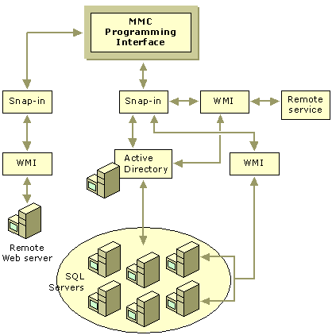

# Using the WMI and Active Directory Technologies

Snap-ins can communicate with the managed objects using whatever interface those objects support (DCOM, RPC, LDAP, and so on), but you should use Windows Management Instrumentation (WMI) and directory services based on Active Directory technology wherever possible. These interfaces encourage uniform access, including scripting, for the underlying functionality provided by the snap-in.

One outcome of their use is to keep the data management application programming interfaces (APIs) separate from the user interface layer (snap-ins). A snap-in should simply function as a way to invoke management services that are defined by an API.

A snap-in can use two complementary technologies (WMI and Active Directory) to interact with other applications, services, hardware, data, and devices. The figure below illustrates the use of these technologies with MMC to access a variety of objects. Be aware that one snap-in uses Active Directory to locate all the available computers running SQL Server and select two to perform a service. The snap-in then uses WMI to actually interact with the servers to perform the task.

 

 

