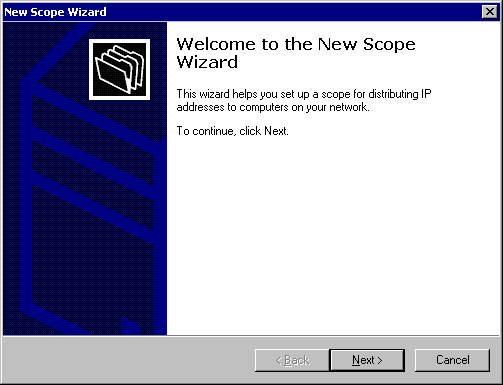

# Wizards

In an MMC snap-in, use wizards to automate complicated tasks or to provide a helping hand for novice users. You can display a wizard at any time, for example, when you add a snap-in to a console, or in response to a menu or toolbar command. The figure below shows the first page of the New Scope Wizard from the DHCP snap-in.

For more information about MMC wizards, see [Adding Property Pages and Wizard Pages](adding-property-pages-and-wizard-pages.md).

 

 

