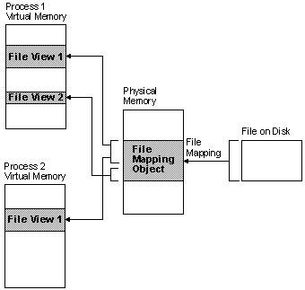

# File Mapping

*File mapping* is the association of a file's contents with a portion of the virtual address space of a process. The system creates a *file mapping object* (also known as a *section object*) to maintain this association. A *file view* is the portion of virtual address space that a process uses to access the file's contents. File mapping allows the process to use both random input and output (I/O) and sequential I/O. It also allows the process to work efficiently with a large data file, such as a database, without having to map the whole file into memory. Multiple processes can also use memory-mapped files to share data.

Processes read from and write to the file view using pointers, just as they would with dynamically allocated memory. The use of file mapping improves efficiency because the file resides on disk, but the file view resides in memory. Processes can also manipulate the file view with the [**VirtualProtect**](/windows/win32/api/memoryapi/nf-memoryapi-virtualprotect) function.

The following illustration shows the relationship between the file on disk, a file mapping object, and a file view.

The file on disk can be any file that you want to map into memory, or it can be the system page file. The file mapping object can consist of all or only part of the file. It is backed by the file on disk. This means that when the system swaps out pages of the file mapping object, any changes made to the file mapping object are written to the file. When the pages of the file mapping object are swapped back in, they are restored from the file.

A file view can consist of all or only part of the file mapping object. A process manipulates the file through the file views. A process can create multiple views for a file mapping object. The file views created by each process reside in the virtual address space of that process. When the process needs data from a portion of the file other than what is in the current file view, it can unmap the current file view, then create a new file view.

When multiple processes use the same file mapping object to create views for a local file, the data is coherent. That is, the views contain identical copies of the file on disk. The file cannot reside on a remote computer if you want to share memory between multiple processes.

For more information, see the following topics:

-   [Creating a File Mapping Object](creating-a-file-mapping-object.md)
-   [Creating a File View](creating-a-file-view.md)
-   [Sharing Files and Memory](sharing-files-and-memory.md)
-   [Reading and Writing From a File View](reading-and-writing-from-a-file-view.md)
-   [Closing a File Mapping Object](closing-a-file-mapping-object.md)
-   [File Mapping Security and Access Rights](file-mapping-security-and-access-rights.md)
-   [Using File Mapping](using-file-mapping.md)

 

 
