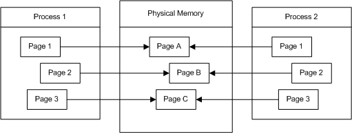
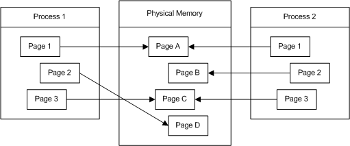

# Memory Protection

Memory that belongs to a process is implicitly protected by its private virtual address space. In addition, Windows provides memory protection by using the virtual memory hardware. The implementation of this protection varies with the processor, for example, code pages in the address space of a process can be marked read-only and protected from modification by user-mode threads.

For the complete list of attributes, see [Memory Protection Constants](memory-protection-constants.md).

## Copy-on-Write Protection

Copy-on-write protection is an optimization that allows multiple processes to map their virtual address spaces such that they share a physical page until one of the processes modifies the page. This is part of a technique called *lazy evaluation*, which allows the system to conserve physical memory and time by not performing an operation until absolutely necessary.

For example, suppose two processes load pages from the same DLL into their virtual memory spaces. These virtual memory pages are mapped to the same physical memory pages for both processes. As long as neither process writes to these pages, they can map to and share, the same physical pages, as shown in the following diagram.

If Process 1 writes to one of these pages, the contents of the physical page are copied to another physical page and the virtual memory map is updated for Process 1. Both processes now have their own instance of the page in physical memory. Therefore, it is not possible for one process to write to a shared physical page and for the other process to see the changes.

## Loading Applications and DLLs

When multiple instances of the same Windows-based application are loaded, each instance is run in its own protected virtual address space. However, their instance handles (*hInstance*) typically have the same value. This value represents the base address of the application in its virtual address space. If each instance can be loaded into its default base address, it can map to and share the same physical pages with the other instances, using copy-on-write protection. The system allows these instances to share the same physical pages until one of them modifies a page. If for some reason one of these instances cannot be loaded in the desired base address, it receives its own physical pages.

DLLs are created with a default base address. Every process that uses a DLL will try to load the DLL within its own address space at the default virtual address for the DLL. If multiple applications can load a DLL at its default virtual address, they can share the same physical pages for the DLL. If for some reason a process cannot load the DLL at the default address, it loads the DLL elsewhere. Copy-on-write protection forces some of the DLL's pages to be copied into different physical pages for this process, because the fixes for jump instructions are written within the DLL's pages, and they will be different for this process. If the code section contains many references to the data section, this can cause the entire code section to be copied to new physical pages.

 

 

