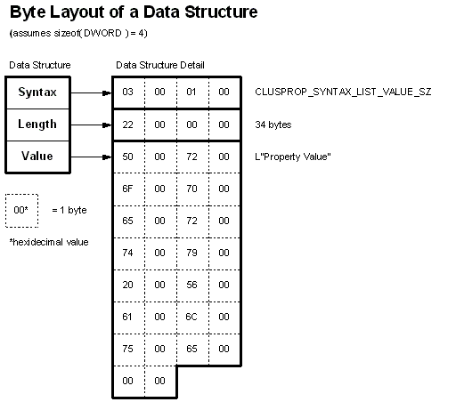

# About Data Structures

The [Failover Cluster API](the-server-cluster-api.md) defines a number of [data structures](data-structures.md) that are used as building blocks of [value lists](value-lists.md). A data structure acts as a "header" for an area of memory, describing the type and length of the data that follows. A data structure consists of the following members.

-   A **Syntax** member describing the format and type of the data value.
-   A [**Length**](data-length.md) member describing the byte size of the data value.
-   A data value member holding the data.

This architecture is shown in the following diagram.

When "stacked" contiguously in a buffer, data structures allow parsing routines to search for specific data values by reading the **Syntax** member, and advance past blocks of data by using the [**Length**](data-length.md) member.

Note that the **Syntax** and [**Length**](data-length.md) members are actually members of the [**CLUSPROP\_VALUE**](clusprop-value.md) structure. The definition of each data structure in ClusAPI.h includes a **CLUSPROP\_VALUE** structure. Therefore, the actual architecture of a data structure consists of the following:

-   A [**CLUSPROP\_VALUE**](clusprop-value.md) member
-   A data value member

However, when describing and using data structures, it is more convenient to refer to the **Syntax** and [**Length**](data-length.md) members explicitly as if they were data structure members.

For more information on each of these members, refer to the following sections.

-   [Data Syntax](data-syntax.md)
-   [Data Length](data-length.md)
-   [Data Value](data-value.md)

 

 

