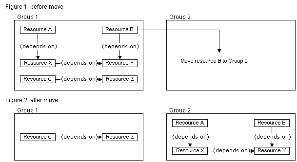

# ClusResource.ChangeResourceGroup method

\[The **ChangeResourceGroup** method is available for use in the operating systems specified in the Requirements section. It may be altered or unavailable in subsequent versions.\]

Removes the [resource](resources.md) from its current [group](groups.md) and places it in a different group.

## Syntax


```VB
ClusResource.ChangeResourceGroup( _
  ByVal objResGroup _
)
```


## Parameters

<dl> <dt>

*objResGroup* 
</dt> <dd>

The [**ClusResGroup**](clusresgroup-object.md) object that should add the resource as a member.

</dd> </dl>

## Return value

This method does not return a value.

## Remarks

Both groups must be hosted by the same node at the time the resource is moved.

If the resource is involved in a [*dependency relationship*](https://www.bing.com/search?q=*dependency relationship*) with one or more resources, all the resources in the dependency tree will change to the new group as well. For example, in the situation shown in the following diagram, changing resource B to group 2 will move the entire dependency tree (resources A, X, and Y) to group 2.



For more information, see [Resource Dependencies](resource-dependencies.md).

## Requirements


|                                     |                                                                                       |
|-------------------------------------|---------------------------------------------------------------------------------------|
| Minimum supported client<br/> | None supported<br/>                                                             |
| Minimum supported server<br/> | Windows Server 2008 Enterprise, Windows Server 2008 Datacenter<br/>             |
| Header<br/>                   | <dl> <dt>MsClus.h</dt> </dl>   |
| IDL<br/>                      | <dl> <dt>MsClus.idl</dt> </dl> |
| Type library<br/>             | <dl> <dt>MsClus.tlb</dt> </dl> |
| DLL<br/>                      | <dl> <dt>MsClus.dll</dt> </dl> |
| IID<br/>                      | IID\_ISClusResource is defined as F2E6070A-2631-11D1-89F1-00A0C90D061E<br/>     |


## See also

<dl> <dt>

[**ClusResGroup**](clusresgroup-object.md)
</dt> <dt>

[**ClusResource**](clusresource-object.md)
</dt> </dl>

 

 


