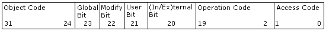

# Control Code Architecture

If you want to create your own [control codes](about-control-codes.md), you will need to refer to the information in this section. You do not need to know how control codes are defined in order to use them in control code functions. However, understanding the internal architecture of control codes can help you use them more efficiently.

Control codes consist of seven smaller numbers arranged to form a 32-bit value. The bit layout is shown in the following illustration:

## Object Code (bits 24–31)

The 8-bit object component indicates the type of cluster object to which the control code applies. Possible values are enumerated by the [**CLUSTER\_CONTROL\_OBJECT**](cluster-control-object.md) enumeration:

| Name                                        | Value           |
|---------------------------------------------|-----------------|
| **CLUS\_OBJECT\_CLUSTER**         | 0x40  |
| **CLUS\_OBJECT\_GROUP**           | 0x04  |
| **CLUS\_OBJECT\_NETWORK**         | 0x10  |
| **CLUS\_OBJECT\_NETINTERFACE**    | 0x20  |
| **CLUS\_OBJECT\_NODE**            | 0x08  |
| **CLUS\_OBJECT\_RESOURCE**        | 0x01  |
| **CLUS\_OBJECT\_RESOURCE\_TYPE**  | 0x02  |
| **CLUS\_OBJECT\_USER**            | 0x80  |

 

All of the values except **CLUS\_OBJECT\_USER** represent object types defined by Windows Failover Clustering.

These values are shifted left **CLCTL\_OBJECT\_SHIFT** (24) bits in the cluster control value.

## Global Bit (bit 23)

The global bit indicates whether the control code represents a global operation that must be performed on each cluster [node](nodes.md). Their possible values are the following:

| Name                                                        | Value               |
|-------------------------------------------------------------|---------------------|
| **CLUS\_NOT\_GLOBAL**                             | 0x0       |
| **CLUS\_GLOBAL**&lt;&lt;**CLCTL\_GLOBAL\_SHIFT**  | 0x800000  |

 

The [CLUSCTL\_RESOURCE\_STORAGE\_CLUSTER\_DISK](clusctl-resource-storage-cluster-disk.md) and [CLUSCTL\_RESOURCE\_NETNAME\_CREDS\_UPDATED](clusctl-resource-netname-creds-updated.md) control codes are the only global control codes.

## Modify Bit (bit 22)

The modify bit indicates whether the control code causes a modification to data that, in turn, may generate an event notification. Possible values:

| Name                                                        | Value               |
|-------------------------------------------------------------|---------------------|
| **CLUS\_NO\_MODIFY**                              | 0x0       |
| **CLUS\_MODIFY**&lt;&lt;**CLCTL\_MODIFY\_SHIFT**  | 0x400000  |

 

## User Bit (bit 21)

The user bit indicates whether the control code is user-defined or defined by Windows Failover Clustering. Possible values:

| Name                                | Value               |
|-------------------------------------|---------------------|
| **CLCTL\_CLUSTER\_BASE**  | 0x0       |
| **CLCTL\_USER\_BASE**     | 0x200000  |

 

## Internal/External Bit (bit 20)

The internal/external bit categorizes the control code as either internal or external. [*Internal control codes*](i-gly.md#-wolf-internal-control-code-gly) set this bit; [*external control codes*](e-gly.md#-wolf-external-control-code-gly) do not. An internal control code can be used only by the [Cluster service](cluster-service.md), meaning that applications cannot pass internal control codes as parameters to the control functions of the [Cluster API](cluster-api.md). Internal control codes are typically sent by the Cluster service to notify a [resource](resources.md) or [resource type](resource-types.md)of an event. The external control codes are used by applications to initiate an operation. Their possible values are the following:

| Name                                                      | Value               |
|-----------------------------------------------------------|---------------------|
| External                                        | 0x0       |
| Internal (1&lt;&lt;**CLCTL\_INTERNAL\_SHIFT**)  | 0x100000  |

 

## Operation Code (bits 0–19)

The operation code describes the operation that a control code will perform. The procedures for using control codes that have different object codes but the same operation code are nearly identical. For more information, see [Using Control Codes](using-control-codes.md).

The following operation codes apply to all or most cluster objects:

-   **CLCTL\_ENUM\_COMMON\_PROPERTIES**
-   **CLCTL\_ENUM\_PRIVATE\_PROPERTIES**
-   **CLCTL\_GET\_CHARACTERISTICS**
-   **CLCTL\_GET\_COMMON\_PROPERTIES**
-   **CLCTL\_GET\_COMMON\_PROPERTY\_FMTS**
-   **CLCTL\_GET\_FLAGS**
-   **CLCTL\_GET\_ID** (not for resources or resource types)
-   **CLCTL\_GET\_NAME**
-   **CLCTL\_GET\_PRIVATE\_PROPERTIES**
-   **CLCTL\_GET\_PRIVATE\_PROPERTY\_FMTS**
-   **CLCTL\_GET\_RO\_COMMON\_PROPERTIES**
-   **CLCTL\_GET\_RO\_PRIVATE\_PROPERTIES**
-   **CLCTL\_SET\_COMMON\_PROPERTIES**
-   **CLCTL\_SET\_PRIVATE\_PROPERTIES**
-   **CLCTL\_UNKNOWN**
-   **CLCTL\_VALIDATE\_COMMON\_PROPERTIES**
-   **CLCTL\_VALIDATE\_PRIVATE\_PROPERTIES**

ClusAPI.h defines other operation codes that are object-specific, particularly for resources and resource types. For a complete list, see the [**CLCTL\_CODES**](clctl-codes.md) enumeration.

## Access Code (bits 0–1)

The access code (the lower two bits of the Operation Code) indicates whether the initiator of the request requires any specific type of access to perform the operation described by the operation code. Possible values:

| Name                               | Value          |
|------------------------------------|----------------|
| **CLUS\_ACCESS\_ANY**    | 0x0  |
| **CLUS\_ACCESS\_READ**   | 0x1  |
| **CLUS\_ACCESS\_WRITE**  | 0x2  |

 

 

 

