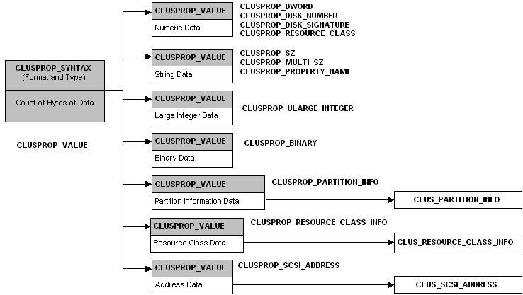

# Data Structures

The failover cluster data structures contain cluster information for [value lists](value-lists.md).

Many of these data structures include other data structures as members:

-   Most structures that describe data of a particular type include a [**CLUSPROP\_VALUE**](clusprop-value.md) structure as the first member.
-   The [**CLUSPROP\_VALUE**](clusprop-value.md) structure uses a [**CLUSPROP\_SYNTAX**](clusprop-syntax.md) union as its first member.
-   Some of the data structures use other data structures to store data values. For example, the [**CLUSPROP\_SCSI\_ADDRESS**](clusprop-scsi-address.md) structure uses a [**CLUS\_SCSI\_ADDRESS**](clus-scsi-address.md) structure to hold the data for a SCSI device.

If a structure contains other structures as members, the description of the structure lists the members of the contained structures explicitly, rather than simply listing the contained structure. For example, ClusAPI.h defines a [**CLUSPROP\_SZ**](clusprop-sz.md) structure as follows:

``` syntax
typedef struct _CLUSPROP_SZ {
  CLUSPROP_VALUE;
  WCHAR           sz[];
} CLUSPROP_SZ, *PCLUSPROP_SZ;
```

To promote clarity, this documentation describes [**CLUSPROP\_SZ**](clusprop-sz.md) as:

``` syntax
typedef struct _CLUSPROP_SZ {
  CLUSPROP_SYNTAX Syntax;
  DWORD           cbLength;
  WCHAR           sz[];
} CLUSPROP_SZ, *PCLUSPROP_SZ;
```

The following diagram shows the relationship between many of the structures used as headers, the structures used to describe data values, and the structures used to hold data for the data values:



## In this section

<dl> <dt>

[**CLUS\_PARTITION\_INFO\_EX2**](clus-partition-info-ex2.md)
</dt> <dd>

Describes the disk partition information of a [storage class resource](s-gly.md#-wolf-storage-class-resource-gly).

</dd> <dt>

[**CLUSPROP\_PARTITION\_INFO\_EX2**](clusprop-partition-info-ex2.md)
</dt> <dd>

A value list entry that contains partition information for a storage class resource. This structure is as a input, and a as a return value for the [CLUSCTL\_RESOURCE\_STORAGE\_GET\_DISK\_INFO\_EX2](clusctl-resource-storage-get-disk-info-ex2.md) control code.

</dd> <dt>

[**CLUS\_CHKDSK\_INFO**](clus-chkdsk-info.md)
</dt> <dd>

Represents information about a Chkdsk operation.

</dd> <dt>

[**CLUS\_CSV\_MAINTENANCE\_MODE\_INFO**](clus-csv-maintenance-mode-info.md)
</dt> <dd>

enables or disables the maintenance mode on a cluster shared volume (CSV).

</dd> <dt>

[**CLUS\_CSV\_VOLUME\_INFO**](clus-csv-volume-info.md)
</dt> <dd>

Represents information about a cluster shared volume (CSV).

</dd> <dt>

[**CLUS\_CSV\_VOLUME\_NAME**](clus-csv-volume-name.md)
</dt> <dd>

Represents the name of a cluster shared volume (CSV).

</dd> <dt>

[**CLUS\_DISK\_NUMBER\_INFO**](clus-disk-number-info.md)
</dt> <dd>

Represents information about the disk number of a physical disk.

</dd> <dt>

[**CLUS\_DNN\_LEADER\_STATUS**](clus-dnn-leader-status.md)
</dt> <dd>

Represents the status of a Distributed Network Name (DNN) resource for a Scale-Out File Server.

</dd> <dt>

[**CLUS\_DNN\_SODAFS\_CLONE\_STATUS**](clus-dnn-sodafs-clone-status.md)
</dt> <dd>

Represents the status of a Scale-Out File Server clone.

</dd> <dt>

[**CLUS\_FORCE\_QUORUM\_INFO**](clus-force-quorum-info.md)
</dt> <dd>

Specifies information about the list of [nodes](nodes.md) sufficient to establish quorum in a majority-of-nodes cluster.

</dd> <dt>

[**CLUS\_FTSET\_INFO**](clus-ftset-info.md)
</dt> <dd>

Contains information about an FT (fault tolerant) set. This structure is used by the [**CLUSPROP\_FTSET\_INFO**](clusprop-ftset-info.md) structure to create an entry in a value list.

</dd> <dt>

[**CLUS\_MAINTENANCE\_MODE\_INFO**](clus-maintenance-mode-info.md)
</dt> <dd>

Enables or disables maintenance mode on a cluster node.

</dd> <dt>

[**CLUS\_MAINTENANCE\_MODE\_INFOEX**](clus-maintenance-mode-infoex.md)
</dt> <dd>

Represents the extended maintenance mode settings for a storage class resource.

</dd> <dt>

[**CLUS\_NETNAME\_IP\_INFO\_ENTRY**](clus-netname-ip-info-entry.md)
</dt> <dd>

Represents IP information for a NetName resource.

</dd> <dt>

[**CLUS\_NETNAME\_IP\_INFO\_FOR\_MULTICHANNEL**](clus-netname-ip-info-for-multichannel.md)
</dt> <dd>

Represents IP information for a NetName resource that has Multichannel enabled.

</dd> <dt>

[**CLUS\_NETNAME\_PWD\_INFO**](clus-netname-pwd-info.md)
</dt> <dd>

Provides information for resetting the security principal associated with a computer name.

</dd> <dt>

[**CLUS\_NETNAME\_VS\_TOKEN\_INFO**](clus-netname-vs-token-info.md)
</dt> <dd>

Contains the data needed to request a token. It is used as the input parameter of the [CLUSCTL\_RESOURCE\_NETNAME\_GET\_VIRTUAL\_SERVER\_TOKEN](clusctl-resource-netname-get-virtual-server-token.md) control code.

</dd> <dt>

[**CLUS\_PARTITION\_INFO**](clus-partition-info.md)
</dt> <dd>

Contains data describing a [storage class resource](s-gly.md#-wolf-storage-class-resource-gly) volume and file system. It is used as the data member of a [**CLUSPROP\_PARTITION\_INFO**](clusprop-partition-info.md) structure and as the return value of some [control code](control-codes.md) operations.

</dd> <dt>

[**CLUS\_PARTITION\_INFO\_EX**](clus-partition-info-ex.md)
</dt> <dd>

Describes a [storage class resource](s-gly.md#-wolf-storage-class-resource-gly) volume and file system.

</dd> <dt>

[**CLUS\_PROVIDER\_STATE\_CHANGE\_INFO**](clus-provider-state-change-info.md)
</dt> <dd>

Contains data about the state of a [provider](p-gly.md#-wolf-provider-gly) resource.

</dd> <dt>

[**CLUS\_RESOURCE\_CLASS\_INFO**](clus-resource-class-info.md)
</dt> <dd>

Contains resource class data. It is used as the data member of a [**CLUSPROP\_RESOURCE\_CLASS\_INFO**](clusprop-resource-class-info.md) structure and as the return value of some [control code](control-codes.md) operations.

</dd> <dt>

[**CLUS\_SCSI\_ADDRESS**](clus-scsi-address.md)
</dt> <dd>

Contains [SCSI](s-gly.md#-wolf-small-computer-system-interface-gly) address data. It is used as the data member of a [**CLUSPROP\_SCSI\_ADDRESS**](clusprop-scsi-address.md) structure and as the return value of some [control code](control-codes.md) operations.

</dd> <dt>

[**CLUS\_SHARED\_VOLUME\_BACKUP\_MODE**](clus-shared-volume-backup-mode.md)
</dt> <dd>

Describes the backup mode for CSV

</dd> <dt>

[**CLUS\_STARTING\_PARAMS**](clus-starting-params.md)
</dt> <dd>

Indicates whether a [node's](nodes.md) attempt to start the [Cluster service](cluster-service.md) represents an attempt to form or join a [cluster](c-gly.md#-wolf-cluster-gly), and whether the node has attempted to start this version of the Cluster service before. [Resource DLLs](resource-dlls.md) receive the CLUS\_STARTING\_PARAMS structure with the [CLUSCTL\_RESOURCE\_TYPE\_STARTING\_PHASE1](clusctl-resource-type-starting-phase1.md) and [CLUSCTL\_RESOURCE\_TYPE\_STARTING\_PHASE2](clusctl-resource-type-starting-phase2.md) control codes.

</dd> <dt>

[**CLUS\_STORAGE\_GET\_AVAILABLE\_DRIVELETTERS**](clus-storage-get-available-driveletters.md)
</dt> <dd>

Contains a bitmask of the driver letters that are available on a node. It is used as the return value of the [CLUSCTL\_RESOURCE\_TYPE\_STORAGE\_GET\_DRIVELETTERS](clusctl-resource-type-storage-get-driveletters.md) control code.

</dd> <dt>

[**CLUS\_STORAGE\_REMAP\_DRIVELETTER**](clus-storage-remap-driveletter.md)
</dt> <dd>

Identifies the existing and target drive letter for a disk drive on a node.

</dd> <dt>

[**CLUS\_STORAGE\_SET\_DRIVELETTER**](clus-storage-set-driveletter.md)
</dt> <dd>

Supplies drive letter information for a disk partition associated with a storage class resource.

</dd> <dt>

[**CLUSPROP\_BINARY**](clusprop-binary.md)
</dt> <dd>

Describes a binary data value.

</dd> <dt>

[**CLUSPROP\_DISK\_NUMBER**](clusprop-disk-number.md)
</dt> <dd>

Describes a numeric value identifying the physical drive of a disk. It is used as an entry in a [value list](value-lists.md) and consists of:

-   A [**CLUSPROP\_VALUE**](clusprop-value.md) structure describing the format, type, and length of the numeric data.
-   A **DWORD** value identifying the physical drive of a disk.

For convenience, the [**CLUSPROP\_VALUE**](clusprop-value.md) members are listed explicitly:

</dd> <dt>

[**CLUSPROP\_DISK\_SIGNATURE**](clusprop-disk-signature.md)
</dt> <dd>

Describes the signature that is stored on the disk for identifying it to the operating system. The [**CLUSPROP\_DISK\_SIGNATURE**](clusprop-disk-signature.md) structure is used as an entry in a [value list](value-lists.md) and consists of:

-   A [**CLUSPROP\_VALUE**](clusprop-value.md) structure describing the format, type, and length of the numeric data.
-   A **DWORD** value.

For convenience, the [**CLUSPROP\_VALUE**](clusprop-value.md) members are listed explicitly:

</dd> <dt>

[**CLUSPROP\_DWORD**](clusprop-dword.md)
</dt> <dd>

Describes numeric data. It is used as an entry in a [value list](value-lists.md) and consists of:

-   A [**CLUSPROP\_VALUE**](clusprop-value.md) structure describing the format, type, and length of the numeric data.
-   A **DWORD** value.

For convenience, the [**CLUSPROP\_VALUE**](clusprop-value.md) members are listed explicitly:

</dd> <dt>

[**CLUSPROP\_FILETIME**](clusprop-filetime.md)
</dt> <dd>

Describes a date and time stamp for a file.

</dd> <dt>

[**CLUSPROP\_FTSET\_INFO**](clusprop-ftset-info.md)
</dt> <dd>

Contains information about an FT (fault tolerant) set. It is used as an entry in a [value list](value-lists.md) and consists of a [**CLUSPROP\_VALUE**](clusprop-value.md) and a [**CLUS\_FTSET\_INFO**](clus-ftset-info.md) structure.

</dd> <dt>

[**CLUSPROP\_LARGE\_INTEGER**](clusprop-large-integer.md)
</dt> <dd>

Describes a signed large integer. It is used as an entry in a [value list](value-lists.md) and consists of:

-   A [**CLUSPROP\_VALUE**](clusprop-value.md) structure indicating the format and type of the integer value.
-   Assigned large integer value.

For convenience, the [**CLUSPROP\_VALUE**](clusprop-value.md) members are listed explicitly.

</dd> <dt>

[**CLUSPROP\_LONG**](clusprop-long.md)
</dt> <dd>

Describes signed **LONG** data. It is used as an entry in a [value list](value-lists.md) and consists of:

-   A [**CLUSPROP\_VALUE**](clusprop-value.md) structure describing the format, type, and length of the numeric data.
-   A **LONG** value.

For convenience, the [**CLUSPROP\_VALUE**](clusprop-value.md) members are listed explicitly:

</dd> <dt>

[**CLUSPROP\_MULTI\_SZ**](clusprop-multi-sz.md)
</dt> <dd>

Describes multiple **NULL**-terminated Unicode strings. It is used as an entry in a [value list](value-lists.md) and consists of:

-   A [**CLUSPROP\_VALUE**](clusprop-value.md) structure describing the format, type, and length of the partition information.
-   A string array.

For convenience, the [**CLUSPROP\_VALUE**](clusprop-value.md) members are listed explicitly:

</dd> <dt>

[**CLUSPROP\_PARTITION\_INFO**](clusprop-partition-info.md)
</dt> <dd>

Contains information relevant to [storage class resources](s-gly.md#-wolf-storage-class-resource-gly).

</dd> <dt>

[**CLUSPROP\_PARTITION\_INFO\_EX**](clusprop-partition-info-ex.md)
</dt> <dd>

The [**CLUSPROP\_PARTITION\_INFO\_EX**](clusprop-partition-info-ex.md) structure contains information relevant to [storage class resources](s-gly.md#-wolf-storage-class-resource-gly).

</dd> <dt>

[**CLUSPROP\_PROPERTY\_NAME**](clusprop-property-name.md)
</dt> <dd>

Describes the name of a property. It is used as an entry in a [value list](value-lists.md) and consists of:

-   A [**CLUSPROP\_VALUE**](clusprop-value.md) structure describing the format, type, and length of the property name.
-   A null-terminated Unicode string.

For convenience, the [**CLUSPROP\_VALUE**](clusprop-value.md) members are listed explicitly:

</dd> <dt>

[**CLUSPROP\_REQUIRED\_DEPENDENCY**](clusprop-required-dependency.md)
</dt> <dd>

Describes a [resource](resources.md) that is a required [dependency](resource-dependencies.md) of another resource. This union is used as a value in the [value list](value-lists.md) returned from a [CLUSCTL\_RESOURCE\_GET\_REQUIRED\_DEPENDENCIES](clusctl-resource-get-required-dependencies.md) or [CLUSCTL\_RESOURCE\_TYPE\_GET\_REQUIRED\_DEPENDENCIES](clusctl-resource-type-get-required-dependencies.md) [control code](control-codes.md) operation.

</dd> <dt>

[**CLUSPROP\_RESOURCE\_CLASS**](clusprop-resource-class.md)
</dt> <dd>

Describes a resource class. It is used as an entry in a [value list](value-lists.md) and consists of:

-   A [**CLUSPROP\_VALUE**](clusprop-value.md) structure describing the format, type, and length of the resource class value.
-   A [**CLUSTER\_RESOURCE\_CLASS**](cluster-resource-class.md) value describing the resource class. **CLUSTER\_RESOURCE\_CLASS** is an enumeration defined in ClusAPI.h.

For convenience, the [**CLUSPROP\_VALUE**](clusprop-value.md) members are listed explicitly:

</dd> <dt>

[**CLUSPROP\_RESOURCE\_CLASS\_INFO**](clusprop-resource-class-info.md)
</dt> <dd>

Describes information relating to a resource class. It is used as an entry in a [value list](value-lists.md) and consists of:

-   A [**CLUSPROP\_VALUE**](clusprop-value.md) structure indicating the format and type of the resource class information.
-   A [**CLUS\_RESOURCE\_CLASS\_INFO**](clus-resource-class-info.md) structure describing the resource class and subclass of the resource.

For convenience, the [**CLUSPROP\_VALUE**](clusprop-value.md) and [**CLUS\_RESOURCE\_CLASS\_INFO**](clus-resource-class-info.md) members are listed explicitly.

</dd> <dt>

[**CLUSPROP\_SCSI\_ADDRESS**](clusprop-scsi-address.md)
</dt> <dd>

Describes an address for a [SCSI](s-gly.md#-wolf-small-computer-system-interface-gly) device. It is used as an entry in a [value list](value-lists.md) and consists of:

-   A [**CLUSPROP\_VALUE**](clusprop-value.md) structure indicating the format and type of the resource class information.
-   A [**CLUS\_SCSI\_ADDRESS**](clus-scsi-address.md) structure.

For convenience, the [**CLUSPROP\_VALUE**](clusprop-value.md) and [**CLUS\_SCSI\_ADDRESS**](clus-scsi-address.md) members are listed explicitly.

</dd> <dt>

[**CLUSPROP\_SECURITY\_DESCRIPTOR**](clusprop-security-descriptor.md)
</dt> <dd>

Describes a security descriptor.

</dd> <dt>

[**CLUSPROP\_SYNTAX**](clusprop-syntax.md)
</dt> <dd>

Describes the format and type of a data value. It is used as the **Syntax** member of the [**CLUSPROP\_VALUE**](clusprop-value.md) structure.

</dd> <dt>

[**CLUSPROP\_SZ**](clusprop-sz.md)
</dt> <dd>

Describes a null-terminated Unicode string. It is used as an entry in a [value list](value-lists.md) and consists of:

-   A [**CLUSPROP\_VALUE**](clusprop-value.md) structure indicating the format and type of string.
-   A null-terminated Unicode string.

For convenience, the [**CLUSPROP\_VALUE**](clusprop-value.md) members are listed explicitly.

</dd> <dt>

[**CLUSPROP\_ULARGE\_INTEGER**](clusprop-ularge-integer.md)
</dt> <dd>

Describes an unsigned large integer. It is used as an entry in a [value list](value-lists.md) and consists of:

-   A [**CLUSPROP\_VALUE**](clusprop-value.md) structure indicating the format and type of the integer value.
-   An unsigned large integer value.

For convenience, the [**CLUSPROP\_VALUE**](clusprop-value.md) members are listed explicitly.

</dd> <dt>

[**CLUSPROP\_VALUE**](clusprop-value.md)
</dt> <dd>

Describes the syntax and length of a data value used in a [value list](value-lists.md). The [**CLUSPROP\_VALUE**](clusprop-value.md) structure is used as a generic header in all of the structures that describe data of a particular type, such as [**CLUSPROP\_BINARY**](clusprop-binary.md) and [**CLUSPROP\_SZ**](clusprop-sz.md).

</dd> <dt>

[**CLUSPROP\_WORD**](clusprop-word.md)
</dt> <dd>

Describes numeric data. It is used as an entry in a [value list](value-lists.md) and consists of:

-   A [**CLUSPROP\_VALUE**](clusprop-value.md) structure describing the format, type, and length of the numeric data.
-   A **WORD** value.

For convenience, the [**CLUSPROP\_VALUE**](clusprop-value.md) members are listed explicitly:

</dd> <dt>

[**SR\_RESOURCE\_TYPE\_DISK\_INFO**](sr-resource-type-disk-info.md)
</dt> <dd>

Describes a set of information that indicates whether a disk is eligible for replication.

</dd> <dt>

[**SR\_RESOURCE\_TYPE\_ELIGIBLE\_DISKS\_RESULT**](sr-resource-type-eligible-disks-result.md)
</dt> <dd>

Describes a set of data disks retrieved by a resource type control code operation for storage replication.

</dd> <dt>

[**SR\_RESOURCE\_TYPE\_QUERY\_ELIGIBLE\_LOGDISKS**](sr-resource-type-query-eligible-logdisks.md)
</dt> <dd>

Describes a set of retrieved disks that can be used as log disks for the specified data disk.

</dd> <dt>

[**SR\_RESOURCE\_TYPE\_QUERY\_ELIGIBLE\_SOURCE\_DATADISKS**](sr-resource-type-query-eligible-source-datadisks.md)
</dt> <dd>

Describes a set of retrieved data disks that can be used as source sites for replication.

</dd> <dt>

[**SR\_RESOURCE\_TYPE\_QUERY\_ELIGIBLE\_TARGET\_DATADISKS**](sr-resource-type-query-eligible-target-datadisks.md)
</dt> <dd>

Describes a set of retrieved data disks that can be used as target sites for replication.

</dd> <dt>

[**SR\_RESOURCE\_TYPE\_REPLICATED\_DISK**](sr-resource-type-replicated-disk.md)
</dt> <dd>

Represents a replicated disk.

</dd> <dt>

[**SR\_RESOURCE\_TYPE\_REPLICATED\_DISKS\_RESULT**](sr-resource-type-replicated-disks-result.md)
</dt> <dd>

Describes a retrieved set of replicated disks.

</dd> <dt>

[**SR\_RESOURCE\_TYPE\_REPLICATED\_PARTITION\_ARRAY**](sr-resource-type-replicated-partition-array.md)
</dt> <dd>

Lists the all replicated partitions on a disk.

</dd> <dt>

[**SR\_RESOURCE\_TYPE\_REPLICATED\_PARTITION\_INFO**](sr-resource-type-replicated-partition-info.md)
</dt> <dd>

Describes a replicated partition.

</dd> </dl>

## Related topics

<dl> <dt>

[Failover Cluster Structures](cluster-structures.md)
</dt> </dl>

 

 


