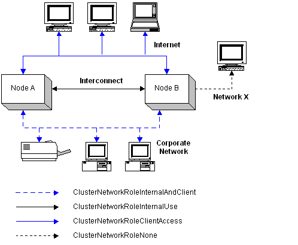

# Networks

A [*failover cluster*](f-gly.md#mscs-failover-cluster-gly) defines a network as a connection between [network interfaces](network-interfaces.md) on the same subnet. A network performs one of the following roles in a [*cluster*](c-gly.md#-wolf-cluster-gly):

-   A private network that carries internal cluster communication. The failover cluster authenticates all internal communication, but administrators who are particularly concerned about security may want to restrict internal communication to physically secure networks.
-   A public network that provides client systems with access to cluster application services. [IP Address](ip-address.md) resources are created on networks that provide clients with access to cluster services.
-   A public-and-private network that carries internal cluster communication and connects client systems to cluster application services.
-   Neither a public nor private network that carries traffic unrelated to cluster operation.

A failover cluster uses all available private and public-and-private networks for internal communication. If there is only one such network available and it fails, the cluster [nodes](nodes.md) stop communicating. Each node attempts to form a new cluster by taking control of the [quorum resource](quorum-resource.md). The node that controls the quorum resource forms a single-node cluster.

To protect the cluster from a single network failure, configure multiple networks as private or public-and-private.

A failover cluster does not use public networks for internal communication, even if a public network is the only available network. For example, a cluster has Network A configured as private and Network B configured as public. Network A fails. The cluster does not use Network B because it is public; thus, the nodes stop communicating and the cluster breaks apart.

The following diagram provides an example of the four roles a network can play. The key below the diagram lists the values that are stored in a network's [**Role**](networks-role.md) property. The private network, **Interconnect**, is used only for internal communication between the cluster nodes. The public network, **Internet**, is used only to connect client systems to the cluster. The public-and-private Corporate Network is used for both client connections and internal communication. Network X represents a network that, for whatever reason, cannot be used by the cluster.

Typically, the cluster enumerates every available network, storing [property](network-common-properties.md) information for each network in the cluster database. An administrator can prevent the [Cluster service](cluster-service.md) from using a network by assigning the value **ClusterNetworkRoleNone** to its [**Role**](networks-role.md) property. Only the first three roles identify a network as one that should be used by the Cluster service.

For more information on working with networks, see the following topics,

[Common Network Properties](network-common-properties.md)

[Network Control Codes](network-control-codes.md)

[Network Management Functions](network-management-functions.md)

 

 

