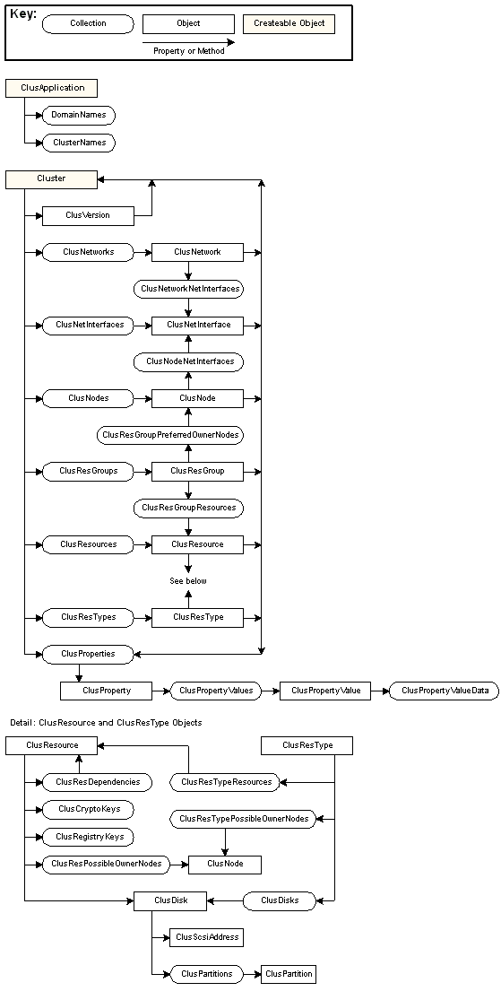

# Failover Cluster Automation Server Object Hierarchy

\[The [Failover Cluster Automation Server](https://msdn.microsoft.com/library/aa372940) is available for use in Windows Server 2008. It may be altered or unavailable in subsequent versions.\]

The [Failover Cluster Automation Server](https://msdn.microsoft.com/library/aa372940) objects follow a functional hierarchy in which the objects and collections that can be obtained from any given object are a function of the object's role in the cluster. For example, a [**ClusResDependencies**](clusresdependencies-collection.md) collection, which controls the [dependency](resource-dependencies.md) relationships for a [resource](resources.md), can only be obtained from a [**ClusResource**](clusresource-object.md) object.

The following diagram illustrates the functional hierarchy. Note that there are only two top-level objects: [**ClusApplication**](clusapplication-object.md) and [**Cluster**](cluster-object.md).

 

 

