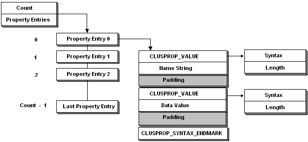

# Property Lists

A property list is a block of memory containing a sequence of [value lists](value-lists.md). Property lists are used as input and output parameters of many [control code functions](control-code-functions.md) and [utility functions](cluster-utility-functions.md).

A property list consists of the following elements:

-   A count of the properties in the list, represented by a [**CLUSPROP\_LIST**](/windows/previous-versions/ClusAPI/ns-clusapi-clusprop_list?branch=master) structure.
-   One [value list](value-lists.md) for each property.
-   Each property value list, in turn, consists of the following entries:
-   A property name represented by a [**CLUSPROP\_PROPERTY\_NAME**](/windows/previous-versions/ClusAPI/?branch=master) structure.
-   A property value, represented by a data structure appropriate to the type of data being stored. The property value can consist of multiple data values, such as an array or a structure.
-   Additional property values, if necessary. Each property value is represented by a data structure and can consist of multiple data values.
-   A [**CLUSPROP\_SYNTAX**](/windows/previous-versions/ClusAPI/ns-clusapi-clusprop_syntax?branch=master) union set to CLUSPROP\_SYNTAX\_ENDMARK.

Typically, the value list for a property contains only one property value. It is possible, however, to have a multi-valued property. When writing code to parse property lists, don't assume there will be only one property value.

The following diagram illustrates the layout of a property list.

For information on creating and parsing property lists, see [Using Property Lists](using-property-lists.md).

 

 

