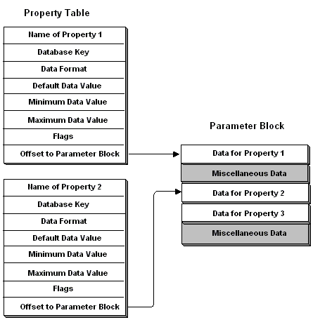

# Property Tables

A property table is an array of [**RESUTIL\_PROPERTY\_ITEM**](/previous-versions/windows/desktop/api/ResApi/ns-resapi-resutil_property_item) structures. Each entry in a property table contains information about a particular property and an offset to the property's data. The data, or a pointer to the data, is stored in a [parameter block](parameter-blocks.md).

The following illustration shows the relationship between a property table and a parameter block. The property table has two entries, each represented by a [**RESUTIL\_PROPERTY\_ITEM**](/previous-versions/windows/desktop/api/ResApi/ns-resapi-resutil_property_item) structure. The **Offset** member of each property-table entry points to a member in the parameter block. Notice that non-property table data is included in the parameter block.

The type of data stored in the **Default**, **Minimum**, and **Maximum** members as well as in the corresponding parameter block depends on the value of the **Format** member. The following list indicates the relationship between the **Format** member and the type of data in the **Default** member and parameter block.

| Format member                | Default member                                               | Parameter block                                                                                    |
|------------------------------|--------------------------------------------------------------|----------------------------------------------------------------------------------------------------|
| CLUSPROP\_FORMAT\_BINARY     | Pointer to a buffer if the value is non-**NULL**.            | **LPBYTE** pointing to the data followed by a **DWORD** to indicate the size of the data in bytes. |
| CLUSPROP\_FORMAT\_DWORD      | **DWORD**                                                    | **DWORD**                                                                                          |
| CLUSPROP\_FORMAT\_EXPAND\_SZ | Pointer to a NULL-terminated Unicode string if non-**NULL**. | **LPWSTR**                                                                                         |
| CLUSPROP\_FORMAT\_MULTI\_SZ  | Pointer to a buffer if the value is non-**NULL**.            | **LPWSTR** pointing to the data followed by a **DWORD** to indicate the size of the data in bytes. |
| CLUSPROP\_FORMAT\_SZ         | Pointer to a NULL-terminated Unicode string if non-**NULL**. | **LPWSTR**                                                                                         |

 

For a discussion of creating and parsing property tables, see [Using Lists and Tables](using-lists-and-tables.md).

 

 

