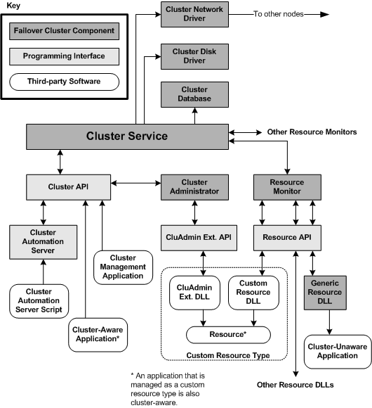

# Failover Cluster Software Components

The following collection of software components implements and provides interfaces for [*failover clusters*](https://www.bing.com/search?q=*failover clusters*).

| Component                                                  | Description                                                                                                                 |
|------------------------------------------------------------|-----------------------------------------------------------------------------------------------------------------------------|
| [Cluster service](cluster-service.md)                     | Controls cluster activities on a node.                                                                                      |
| [Cluster Disk Driver](cluster-disk-driver.md)             | Ensures exclusive access to cluster disks.                                                                                  |
| [Resource Monitors](resource-monitor.md) (one or more )   | Provides a communication, monitoring, and processing layer between the [Cluster service](cluster-service.md) and resources |
| [Resource DLLs](resource-dlls.md) (one or more)           | Carries out most operations on cluster resources.                                                                           |
| [Cluster Database](cluster-database.md)                   | Stores cluster configuration information.                                                                                   |
| [Administration Interfaces](administration-interfaces.md) | Provide interfaces for administering clusters.                                                                              |

 

These components work together to implement failover clusters. The following diagram shows how these failover cluster components relate to applications of various types and to one another within a single Windows server network operating system.

The diagram illustrates several different types of applications that can be created using the [Failover Cluster API](the-server-cluster-api.md). For definitions of these types and procedural overviews of how to create them, see [Failover Cluster Application Types](server-cluster-application-types.md).

 

 

