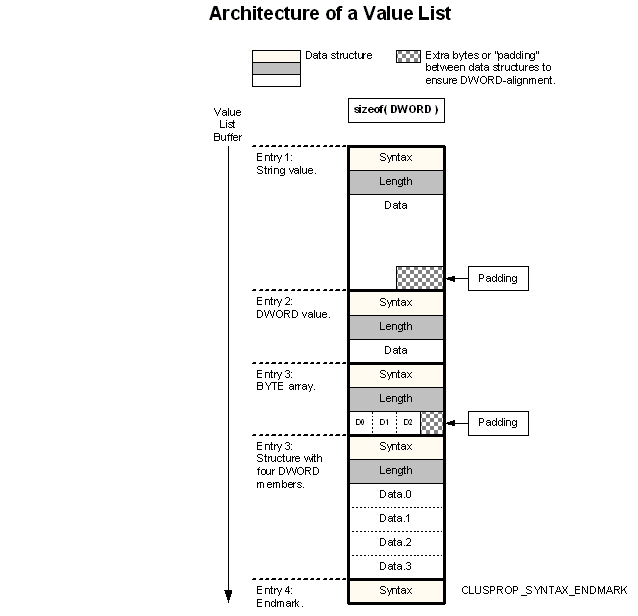

# Value Lists

A value list is a block of memory containing a sequence of [data structures](data-structures.md). Value lists are used as the building blocks of [property lists](property-lists.md) and as return values for some [control code](control-codes.md) operations.

Each data structure in a value list consists of the following elements:

-   A header that describes the [syntax](data-syntax.md) and [length](data-length.md) of the data contained within the structure. For example, many control codes use value lists that use the [**CLUSPROP\_VALUE**](clusprop-value.md) structure as the header. In turn, **CLUSPROP\_VALUE** contains a [**CLUSPROP\_SYNTAX**](clusprop-syntax.md) value that describes the type of data, and a **DWORD** containing the length of that data.
-   The [data itself](data-value.md). Types of data can include a single value (such as a string or **DWORD**), an array of values (such as a **BYTE** array), or a user-defined structure.

For an example that uses a more complex structure than simply a list of [**CLUSPROP\_VALUE**](clusprop-value.md) elements and their associated data, see [Value Lists for Storage Class Resources](value-lists-for-storage-class-resources.md).

> [!Note]  
> each data structure in the value list must be [DWORD-aligned](dword-aligned.md). It is a good idea to zero the memory of your value list buffer before building the list so that bytes used for padding do not contain misleading values.

 

To mark the end of a value list, the last entry in the list contains only the **Syntax** member of a data structure set to **CLUSPROP\_SYNTAX\_ENDMARK**. The last entry has no **Length** member and no data. The following diagram shows the layout of a value list.

For more information on how to build and read value lists, see [Using Value Lists](using-value-lists.md).

 

 

