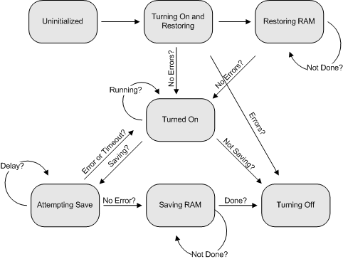

# Virtual Machine State Diagram

The following diagram illustrates the operational states and state transitions of a virtual machine session.

Virtual Server will generate one or more state changed events through the [**IVMVirtualServerEvents::OnVMStateChange**](ivmvirtualserverevents-onvmstatechange.md) and [**IVMVirtualMachineEvents::OnStateChange**](ivmvirtualmachineevents-onstatechange.md) methods every time a virtual machine session changes states. State changes of a virtual machine session are controlled by invoking methods of the [**IVMVirtualMachine**](ivmvirtualmachine.md) interface.

The following table lists the state changed events generated by Virtual Server for virtual machine sessions. 

| IVMVirtualMachine method                                                    | State change events generated                                                                                                      |
|-----------------------------------------------------------------------------|------------------------------------------------------------------------------------------------------------------------------------|
| [**StartUp**](ivmvirtualmachine-startup.md) (no previous state saved)      | vmVMState\_TurningOn  vmVMState\_Running                                                                       |
| [**Save**](ivmvirtualmachine-save.md)                                      | vmVMState\_Saving  vmVMState\_TurningOff  vmVMState\_DeleteMachine  vmVMState\_TurnedOff   |
| [**Startup**](ivmvirtualmachine-startup.md) (restoring from a saved state) | vmVMState\_TurningOn  vmVMState\_Restoring  vmVMState\_Running                                       |
| [**Reset**](ivmvirtualmachine-reset.md)                                    | vmVMState\_TurningOff  vmVMState\_DeleteMachine  vmVMState\_TurningOn  vmVMState\_Running  |
| [**Pause**](ivmvirtualmachine-pause.md)                                    | vmVMState\_Paused                                                                                                        |
| [**Resume**](ivmvirtualmachine-resume.md)                                  | vmVMState\_Running                                                                                                       |
| [**TurnOff**](ivmvirtualmachine-turnoff.md)                                | vmVMState\_TurningOff  vmVMState\_DeleteMachine  vmVMState\_TurnedOff                                |

 

 

 

