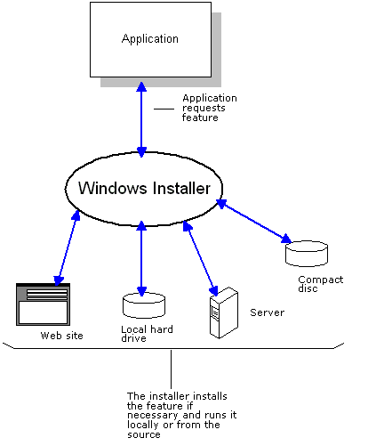

# Component Management

The Windows Installer reduces the total cost of ownership (TCO) of your applications by increasing the ability of your customers to manage and maintain application components during setup and run time. The installation database tracks which applications require a particular component, which files comprise each component, where each file is installed on the system, and where component sources are located. This allows developers to author packages that provide the following benefits:

-   Increased resiliency of applications. Use the installer to detect and reinstall damaged components without having to rerun setup. The installer checks the path of a component at run time. This frees applications from dependency on static file paths which commonly differ between computers and can point to missing components. For more information, see [Resiliency](resiliency.md).
-   Installation-On-Demand. This feature set is not installed during setup but is specified in the database to be installed just-in-time for use if required by the application in the future. Users do not need to rerun setup. For more information, see [Installation-On-Demand](installation-on-demand.md).
-   Advertisement of shortcuts to features, applications, or entire products in the user interface. Users can install these on-demand by using the shortcuts. Users can also remove features, applications, or entire products on-demand. For more information, see [Advertisement](advertisement.md).
-   Installation customization. An administrator can apply transforms to the database that tailor the installation for a particular group of users. For more information, see [Customization](customization.md).
-   Easier deployment of application updates. Use the installer to update your products. For more information, see [Patching and Upgrades](patching-and-upgrades.md).
-   Feature shortcut display. The installer displays shortcuts to features that run locally with shortcuts to features that run remotely. Because the installation database specifies the run context of each feature, visibly equivalent entry points can be presented to users as needed.
-   Keep usage metrics on features. Developers can provide an installation package that keeps usage count of a feature by all client applications and removes components that are not being used.
-   Incorporate installations. Developers can incorporate the component management capabilities of the installer into their applications by authoring an installation package and by using the [Installer Functions](installer-functions.md) in their application code. The following figure illustrates an application requesting the installation of a feature.

    

 

 

