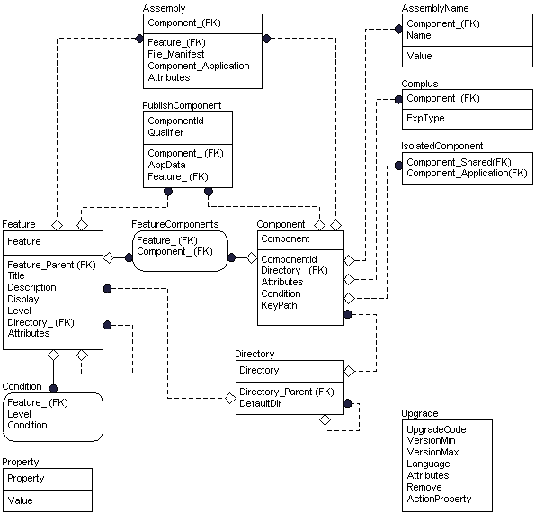

# Core Tables Group

For more information about the following diagram, see the [entity relationship diagram legend](entity-relationship-diagram-legend.md).

The core group consists of tables describing the fundamental features and components of the application and the installer package. Developers of install packages should therefore consider how to populate these tables first because the organization of much of the database will become apparent from the content of this group.

-   The [Feature table](feature-table.md) lists all features belonging to the application.
-   The [Condition table](condition-table.md) contains the conditional expressions that determine whether or not a particular feature will be installed.
-   The [FeatureComponents table](featurecomponents-table.md) describes which components belong to each feature.
-   The [Component table](component-table.md) lists all components belonging to the installation.
-   The [Directory table](directory-table.md) lists the directories that are needed during the installation. Because each component must be associated with one and only one directory, the Component table is closely related to this table and has an external key to the Directory table.
-   The [PublishComponent table](publishcomponent-table.md) lists the features and components that are published for use by other applications. [Components and Features](components-and-features.md) are the two types of feature advertisement.
-   The [MsiAssembly table](msiassembly-table.md) specifies Windows Installer settings for .NET Framework common language runtime assemblies and Win32 assemblies.
-   The [MsiAssemblyName table](msiassemblyname-table.md) specifies the schema for the elements of a strong assembly cache name for a common language runtime or Win32 assembly.
-   The [Complus table](complus-table.md) contains information needed to install COM+ applications.
-   The [IsolatedComponent table](isolatedcomponent-table.md) associates the component specified in the Component\_Application column (commonly an .exe) with the component specified in the Component\_Shared column (commonly a shared DLL).
-   The [Upgrade table](upgrade-table.md) contains information required during [major upgrades](major-upgrades.md).

 

 

