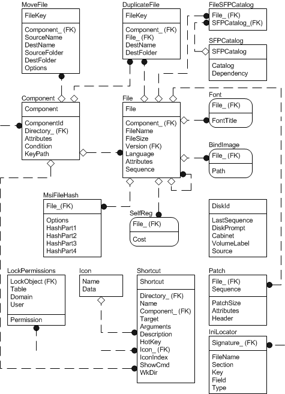

# File Tables Group

For more information about this diagram, see the [entity relationship diagram legend](entity-relationship-diagram-legend.md).

An installer package developer should consider populating the file table group of tables after breaking the application into [components and features](components-and-features.md) and after populating the [core tables group](core-tables-group.md). The file table group contains all of the files belonging to the installation and most of these files are listed in the [File table](file-table.md). The [Directory table](directory-table.md) is not shown in the figure but is closely related to the file table group. The Directory table gives the directory structure of the installation.

The file group of tables contains all of the tables that are related to files.

-   The [File table](file-table.md) lists files belonging to the installation. Files that are not listed in the File table include disk files, which are listed in Media table. Because every file belongs to a component, the File table has an external key into the Component table.
-   The [RemoveFile table](removefile-table.md) contains a list of files to be removed by the [RemoveFiles action](removefiles-action.md).
-   The [Font table](font-table.md) lists font files to be registered with the system.
-   The [SelfReg table](selfreg-table.md) lists module files of the installation that are self-registered.
-   The [Media table](media-table.md) lists the source media and disks belonging to the installation.
-   The [BindImage table](bindimage-table.md) lists files that are bound to DLLs imported by executables.
-   The [MoveFile table](movefile-table.md) specifies which files are moved during the installation.
-   The [DuplicateFile table](duplicatefile-table.md) specifies which files are duplicated during the installation.
-   The [IniFile table](inifile-table.md) lists the .ini files and the information that the application needs to set in the file.
-   The [RemoveIniFile table](removeinifile-table.md) contains the information an application needs to delete from a .ini file.
-   The [Environment table](environment-table.md) is used to set the values of environment variables.
-   The [Icon table](icon-table.md) provides icon information which is copied to a file as a part of product advertisement.
-   The [FileSFPCatalog table](filesfpcatalog-table.md) associates specified files with system file protection catalog files.

    **Windows Vista, Windows Server 2003 and Windows XP:** Not supported.

-   The [SFPCatalog table](sfpcatalog-table.md) contains system file protection catalogs.

    **Windows Vista, Windows Server 2003 and Windows XP:** Not supported.

-   The [MsiFileHash table](msifilehash-table.md) is used to store a 128-bit hash of a source file provided by the Windows Installer package.

 

 

