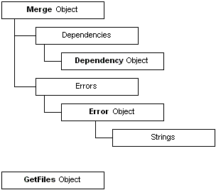

# Object Model for Mergemod.dll Version 1.0

The object model for Mergemod.dll is organized as follows:

The [Merge object](merge-object.md) is the primary object of the model. The [**GetFiles object**](getfiles-object.md) is a secondary object. Dependencies are collections of [**Dependency objects**](dependency-object.md). Errors are collections of [**Error objects**](error-object.md).

 

 

