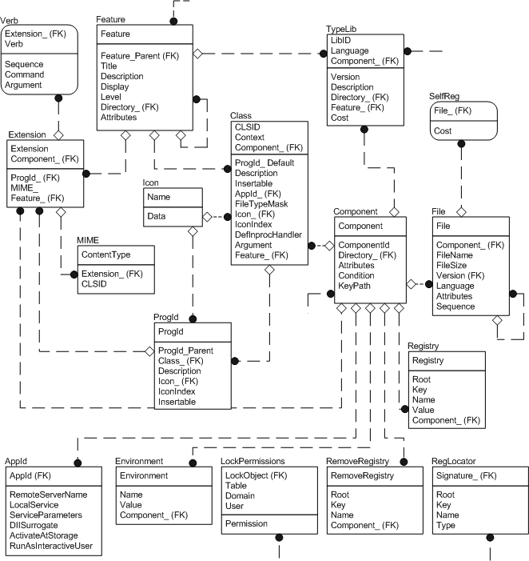

# Registry Tables Group

For more information about this diagram, see the [entity relationship diagram legend](entity-relationship-diagram-legend.md).

The installer has specific tables for the different types of registry entries. When populating the registry tables group it is important to try to minimize the number of entries put into the [Registry table](registry-table.md) and maximize the use of the other, specific, registry tables. This is because the installer cannot distinguish between different types of registry entries in the Registry table and cannot use the internal logic necessary to take full advantage of all of the installer features, such as [*advertising*](a-gly.md). Authoring COM and shell-related registry entries in this way also provides a more logical organization and can help minimize erroneous registration of COM server information.

The figure shows the registry entry group of tables as well as the [Component table](component-table.md), [Feature table](feature-table.md), and [File table](file-table.md). Although the latter are not directly involved with populating the registry, they are included in the figure because they are essential to the logic of the registry entry group.

The registry entry group contain the following tables of specific registry entries.

-   The [Extension table](extension-table.md) contains all of the filename extensions your application uses along with their associated features and components.
-   The [Verb table](verb-table.md) associates command-verb information with the file name extensions listed in the [Extension table](extension-table.md). This provides an indirect link between the Verb and Feature table that is needed for feature advertisement.
-   The [TypeLib table](typelib-table.md) provides information that the installer places in the registry for the registration of type libraries. Type library entries are not written at the time of advertisement. The installer writes the type library entries at the time the components associated with the library are installed.
-   The [MIME table](mime-table.md) associates a MIME context type with a CLSID or a file name extension. This provides a path between the MIME and Feature Table that is needed for feature advertisement.
-   The [SelfReg table](selfreg-table.md) provides information needed to self-register modules. Self-registration is provided by the installer only for backward compatibility and it is not recommended as a method for populating the registry, however if there are any modules in your application that must register themselves, use the SelfReg table.
-   The [Class table](class-table.md) is used to register Class IDs and other information for COM objects. This table contains COM server-related information that must be generated as a part of the product advertisement.
-   The [ProgId table](progid-table.md) associates program IDs with class IDs.
-   The [AppId table](appid-table.md) is used to register common security and configuration settings for DCOM objects.
-   The [Environment table](environment-table.md) is used to set the values of environment variables, and in Windows 2000, the Environment table writes to the registry as well.
-   The [Registry table](registry-table.md) holds any other information that the application needs to put into the system registry. This would include default settings, user information or data, or COM registration not supported by the above tables.
-   The [RemoveRegistry table](removeregistry-table.md) contains the registry information the application needs to delete from the system registry at installation time.

 

 

