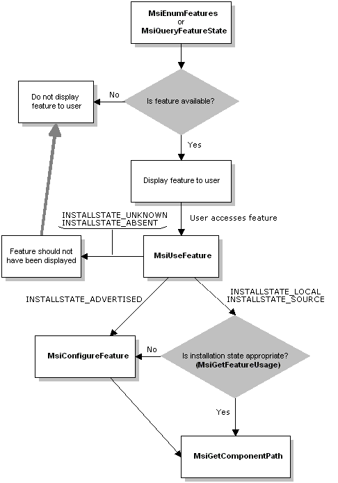

# Requesting a Feature

There are several functions an application must call to request features. Before requesting a feature, the application must ensure that the feature is installed. If the application calls [**MsiUseFeature**](/windows/desktop/api/Msi/nf-msi-msiusefeaturea) before the application accesses a feature, the application can use the information returned to maintain usage metrics.

**To request a feature**

1.  Call the [**MsiEnumFeatures**](/windows/desktop/api/Msi/nf-msi-msienumfeaturesa) or the [**MsiQueryFeatureState**](/windows/desktop/api/Msi/nf-msi-msiqueryfeaturestatea) function if you want to determine the availability of a feature without incrementing the usage count.
2.  Indicate your application's intent to use a feature by calling the [**MsiUseFeature**](/windows/desktop/api/Msi/nf-msi-msiusefeaturea) function.
3.  Determine file locations by calling the [**MsiGetComponentPath**](/windows/desktop/api/Msi/nf-msi-msigetcomponentpatha) function.
4.  Configure the feature by calling the [**MsiConfigureFeature**](/windows/desktop/api/Msi/nf-msi-msiconfigurefeaturea) function.
5.  Obtain usage metrics that your application can use by calling the [**MsiGetFeatureUsage**](/windows/desktop/api/Msi/nf-msi-msigetfeatureusagea) function.

The following diagram illustrates the feature request model.

 

 

