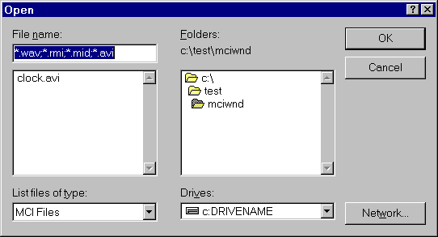

# Allowing the User to Specify Devices and Files

You can associate a device or file with an existing MCIWnd window by using the [**MCIWndOpenDialog**](/windows/desktop/api/Vfw/nf-vfw-mciwndopendialog), [**MCIWndOpen**](/windows/desktop/api/Vfw/nf-vfw-mciwndopen), and [**MCIWndOpenInterface**](/windows/desktop/api/Vfw/nf-vfw-mciwndopeninterface) macros, and the [**GetOpenFileNamePreview**](/windows/desktop/api/Vfw/nf-vfw-getopenfilenamepreviewa) function.

To let a user of your application select a file to play, use **MCIWndOpenDialog**. This macro displays the **Open** dialog box (shown in the following screen shot) for choosing a file and associates the selected file with the current MCIWnd window.

You can let a user of your application select a file to associate with an MCIWnd window and preview that file by using [**GetOpenFileNamePreview**](/windows/desktop/api/Vfw/nf-vfw-getopenfilenamepreviewa) and [**MCIWndOpen**](/windows/desktop/api/Vfw/nf-vfw-mciwndopen). The **GetOpenFileNamePreview** function displays the **Open** dialog box for choosing a file and lets the user preview (play) its contents. When the name of an existing file is specified in the dialog box, **GetOpenFileNamePreview** provides a small control to let the user preview the contents of the file. You can associate a specified file, selected with **GetOpenFileNamePreview** or specified in another manner, with an MCIWnd window by using **MCIWndOpen**.

You can also use **MCIWndOpen** to specify a device to associate with an MCIWnd window. For example, you can use a device name, such as "CDAudio".

To associate an MCIWnd window with a file interface or data-stream interface to multimedia data, use the [**MCIWndOpenInterface**](/windows/desktop/api/Vfw/nf-vfw-mciwndopeninterface) macro. For more information about file and data-stream interfaces, see [AVIFile Functions and Macros](avifile-functions-and-macros.md).

> [!Note]  
> Before associating a new file or device with an MCIWnd window, [**MCIWndOpenDialog**](/windows/desktop/api/Vfw/nf-vfw-mciwndopendialog) and [**MCIWndOpen**](/windows/desktop/api/Vfw/nf-vfw-mciwndopen) close any device currently associated with the window. Your application does not need to close any open devices before using these macros.

 

 

 

