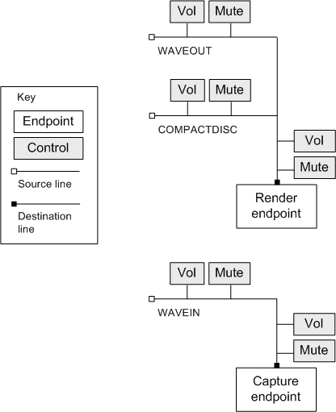

# Audio Mixers in Windows Vista

\[The feature associated with this page, [Audio Mixers](/windows/win32/multimedia/audio-mixers), is a legacy feature. It has been superseded by [Volume Controls](/windows/win32/coreaudio/volume-controls). **Volume Controls** has been optimized for Windows 10 and Windows 11. Microsoft strongly recommends that new code use **Volume Controls** instead of **Audio Mixers**, when possible. Microsoft suggests that existing code that uses the legacy APIs be rewritten to use the new APIs if possible.\]

Starting in Windows Vista, some mixer controls are implemented in software rather than hardware. For example, the volume controls are implemented using the Windows audio session API (WASAPI). These controls do not directly affect hardware settings. In addition, they are associated with a process-specific audio session, so changes affect the calling application but do not affect other applications.

Each audio endpoint device has a standard mixer layout, implemented in software.

-   Each audio rendering endpoint contains one destination line that contains the following:
    -   Volume control
    -   Mute control
    -   Source line: Waveform-audio output.
    -   Source line: Audio CD.
-   Each audio capture endpoint contains one destination line that contains the following:
    -   Volume control
    -   Mute control
    -   Source line: Waveform-audio input. The component type depends on the input device— for example, a microphone.

Each source line contains a volume control and a mute control. The following diagram shows the components of render endpoints and capture endpoints.

All of the controls for an endpoint manipulate the same underlying software control. Therefore, if you change the settings on one control, you will receive a control change notification on the other controls. (See [**MM\_MIXM\_CONTROL\_CHANGE**](mm-mixm-control-change.md).)

This standard layout is provided for compatibility with existing applications that use the audio mixer functions. New applications should avoid using these functions.

 

 

