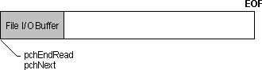
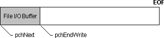
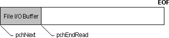
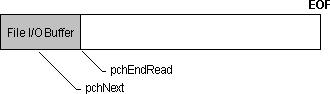
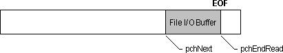
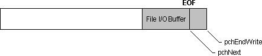

# Buffered Services

Most of the overhead in file I/O occurs when accessing the media device. If you are reading or writing many small blocks of information, the device can spend a lot of time moving to the physical location on the media for each read or write operation. In this case, you can achieve better performance by using buffered file I/O services. With buffered I/O, the file I/O manager maintains an intermediate buffer larger than the blocks of information you are reading or writing. It accesses the device only when the buffer must be filled from or written to the disk.

Before you set up and use buffered file I/O, you must decide whether you want the file I/O manager or the application to allocate the buffer. It is simpler to let the file I/O manager allocate the buffer. However, you can let the application allocate the buffer if you want to directly access the buffer or open a memory file. For more information about using memory files, see [Performing Memory File I/O](performing-memory-file-i-o.md). For an example of directly accessing an I/O buffer, see [Accessing a File I/O Buffer](accessing-a-file-i-o-buffer.md)

A buffer allocated by the file I/O manager is called an internal I/O buffer. To open a file for buffered I/O using an internal buffer, specify the MMIO\_ALLOCBUF flag when you open the file with the [**mmioOpen**](/windows/win32/api/mmiscapi/nf-mmiscapi-mmioopen) function. The following illustration shows the initial state of the file I/O buffer after a file is opened for a buffered read operation. The buffering is transparent — you read and seek as if you were using unbuffered I/O. The **mmioOpen** function has set pchNext and *pchEndRead* to point to the beginning of the file I/O buffer.

The following illustration shows the initial state of the file I/O buffer after a file is opened for a buffered write operation. The **mmioOpen** function has set **pchNext** to point to the beginning of the file I/O buffer and **pchEndWrite** to point to the end of the buffer.

The default size of the internal I/O buffer is 8K. If this size is not adequate, you can use the [**mmioSetBuffer**](/windows/win32/api/mmiscapi/nf-mmiscapi-mmiosetbuffer) function to change the buffer size. You can also use this function to enable buffering on a file opened for unbuffered I/O, or to supply your own buffer for use as a memory file.

You can force the contents of an I/O buffer to be written to disk by using the [**mmioFlush**](/windows/win32/api/mmiscapi/nf-mmiscapi-mmioflush) function. However, when you close a file by using the [**mmioClose**](/windows/win32/api/mmiscapi/nf-mmiscapi-mmioclose) function, you do not have to call **mmioFlush** to flush an I/O buffer — the **mmioClose** function automatically flushes it. If you run out of disk space, **mmioFlush** could fail, even if the preceding calls to the [**mmioWrite**](/windows/win32/api/mmiscapi/nf-mmiscapi-mmiowrite) function were successful. Similarly, **mmioClose** could fail when it is flushing its I/O buffer.

Applications that are performance-sensitive, such as those that stream data in real time from a CD-ROM, can optimize file I/O performance by directly accessing the I/O buffer. You should be careful if you choose to do this, because you bypass some of the safeguards and error checking provided by the file I/O manager.

The multimedia file I/O manager uses the [**MMIOINFO**](/previous-versions//dd757322(v=vs.85)) structure to maintain state information about an open file. You use three members in this structure to read and write the I/O buffer: **pchNext**, **pchEndRead**, and **pchEndWrite**. The **pchNext** member points to the next location in the buffer to read or write. You must increment this member as you read and write the buffer. The **pchEndRead** member identifies the last valid character you can read from the buffer. Likewise, this member identifies the last location in the buffer you can write. More precisely, both **pchEndRead** and **pchEndWrite** point to the memory location that follows the last valid data in the buffer. Use the [**mmioGetInfo**](/windows/win32/api/mmiscapi/nf-mmiscapi-mmiogetinfo) and [**mmioSetInfo**](/windows/win32/api/mmiscapi/nf-mmiscapi-mmiosetinfo) functions to retrieve and set state information about the file I/O buffer. The following illustration shows the state of the I/O buffer after the application calls **mmioAdvance** during a read operation. The **mmioAdvance** function fills the buffer and sets the **pchEndRead** pointer to the end of the buffer.

In the following illustration, the application reads from the I/O buffer at the location specified by **pchNext**, and advances the pointer.

Similarly, for a write operation, the application writes to the I/O buffer and advances the **pchNext** pointer, as shown in the following illustration.

After the application fills the buffer, it calls **mmioAdvance** to flush the buffer to disk. The **mmioAdvance** function resets **pchNext** to point to the beginning of the buffer, as shown in the following illustration.

When you reach the end of the I/O buffer, you must advance the buffer to fill it from the disk, if you are reading, or flush it to the disk, if you are writing. Use the [**mmioAdvance**](/windows/win32/api/mmiscapi/nf-mmiscapi-mmioadvance) function to advance an I/O buffer. To fill an I/O buffer from disk, use **mmioAdvance** with the MMIO\_READ flag. If there is not enough data remaining in the file to fill the buffer, the **pchEndRead** member of the **MMIOINFO** structure points to the location following the last valid byte in the buffer. To flush a buffer to disk, set the MMIO\_DIRTY flag in the **dwFlags** member of the **MMIOINFO** structure and then call **mmioAdvance** with the MMIO\_WRITE flag.

For example, during a read operation, the **mmioAdvance** function sets **pchEndRead** to point to the end of valid data in the buffer, as shown in the following illustration.

Similarly, during a write operation, the application calls **mmioAdvance** to flush the buffer and advance **pchNext** to the end of valid data in the buffer, as shown in the following illustration.

 

 