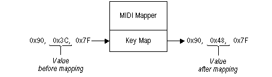

# Key Maps

Each entry in the patch-map translation table can have an associated key map. Key maps affect note-on, note-off, and polyphonic-key-aftertouch messages. A key map has a translation table with an entry for each of the 128 MIDI key values. For example, if the entry for key value 60 is 72, the MIDI Mapper modifies MIDI note-on messages as shown in the following illustration.

Key maps are useful with synthesizers that have key-based percussion instruments with a particular percussion sound assigned to each key. Key maps are usually assigned to the first patch in the patch maps on the percussion channels (10 and 16).

 

 

