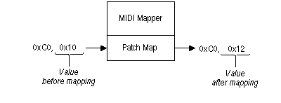

# Patch Maps

Each channel map entry can have an associated patch map. Patch maps affect MIDI program-change and volume-controller messages. Program-change messages tell a synthesizer to change the instrument sound (patch) for a specified channel. Volume-controller messages set the volume for a channel.

A patch map has a translation table with an entry for each of the 128 program-change values. Each patch map specifies the following:

-   A destination program-change value.
-   A volume scalar. (For more information, see [The Volume Scalar](the-volume-scalar.md).)
-   An optional key map. (For more information, see [Key Maps](key-maps.md).)

When program-change messages are received by the MIDI Mapper, the destination program-change value is substituted for the program-change value in the message. For example, if the destination program-change value for program-change 16 is 18, the MIDI Mapper modifies the MIDI program-change message as shown in the following illustration.

 

 

