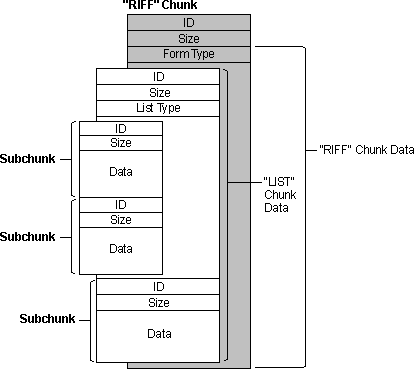

# Resource Interchange File Format Services

\[The feature associated with this page, [Multimedia File I/O](/windows/win32/multimedia/multimedia-file-i-o), is a legacy feature. It has been superseded by [Source Reader](/windows/win32/medfound/source-reader). **Source Reader** has been optimized for Windows 10 and Windows 11. Microsoft strongly recommends that new code use **Source Reader** instead of **Multimedia File I/O**, when possible. Microsoft suggests that existing code that uses the legacy APIs be rewritten to use the new APIs if possible.\]

The preferred format for multimedia files is resource interchange file format (RIFF). The RIFF file I/O functions work with the basic buffered and unbuffered file I/O services. You can open, read, and write RIFF files in the same way as other file types. For detailed information about RIFF, see [AVIFile Functions and Macros](avifile-functions-and-macros.md).

RIFF files use four-character codes to identify file elements. These codes are 32-bit quantities representing a sequence of one to four ASCII alphanumeric characters, padded on the right with space characters. The data type for four-character codes is **FOURCC**. Use the [**mmioFOURCC**](/windows/win32/api/vfw/nf-vfw-mmiofourcc) macro to convert four characters into a four-character code. To convert a null-terminated string into a four-character code, use the [**mmioStringToFOURCC**](/windows/win32/api/mmiscapi/nf-mmiscapi-mmiostringtofourcc) function.

The basic building block of a RIFF file is a *chunk*. A chunk is a logical unit of multimedia data, such as a single frame in a video clip. Each chunk contains the following fields:

-   A four-character code specifying the chunk identifier
-   A doubleword value specifying the size of the data member in the chunk
-   A data field

The following illustration shows a "RIFF" chunk that contains two subchunks.

A chunk contained in another chunk is a *subchunk*. The only chunks allowed to contain subchunks are those with a chunk identifier of "RIFF" or "LIST". A chunk that contains another chunk is called a *parent chunk*. The first chunk in a RIFF file must be a "RIFF" chunk. All other chunks in the file are subchunks of the "RIFF" chunk.

"RIFF" chunks include an additional field in the first four bytes of the data field. This additional field provides the *form type* of the field. The form type is a four-character code identifying the format of the data stored in the file. For example, Microsoft waveform-audio files have a form type of "WAVE".

"LIST" chunks also include an additional field in the first four bytes of the data field. This additional field contains the *list type* of the field. The list type is a four-character code identifying the contents of the list. For example, a "LIST" chunk with a list type of "INFO" can contain "ICOP" and "ICRD" chunks providing copyright and creation date information. The following illustration shows a "RIFF" chunk that contains a "LIST" chunk and one other subchunk (the "LIST" chunk contains two subchunks).

Multimedia file I/O services include two functions you can use to navigate among chunks in a RIFF file: [**mmioAscend**](/windows/win32/api/mmiscapi/nf-mmiscapi-mmioascend) and [**mmioDescend**](/windows/win32/api/mmiscapi/nf-mmiscapi-mmiodescend). You can use these functions as high-level seek functions. When you descend into a chunk, the file position is set to the data field of the chunk (8 bytes from the beginning of the chunk). For "RIFF" and "LIST" chunks, the file position is set to the location following the form type or list type (12 bytes from the beginning of the chunk). When you ascend out of a chunk, the file position is set to the location following the end of the chunk.

To create a new chunk, use the [**mmioCreateChunk**](/windows/win32/api/mmiscapi/nf-mmiscapi-mmiocreatechunk) function to write a chunk header at the current position in an open file. The **mmioAscend**, **mmioDescend**, and **mmioCreateChunk** functions use the [**MMCKINFO**](/windows/win32/api/mmiscapi/ns-mmiscapi-mmckinfo) structure to specify and retrieve information about "RIFF" chunks.

 

 