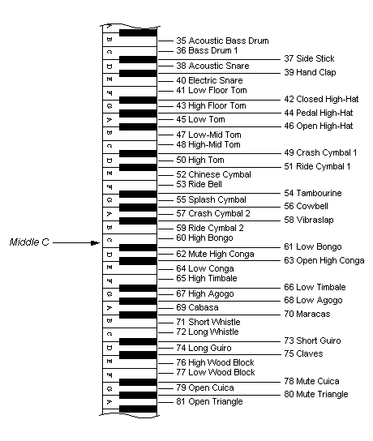

# Standard MIDI Key Assignments

The standard MIDI key assignments for percussion instruments are based on the MMA General MIDI Mode specification. The following illustration shows the standard key assignments for MIDI files authored for Windows.

 

 

