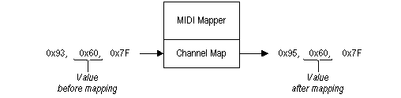

# The Channel Map

The channel map affects all MIDI channel messages. MIDI channel messages include note-on, note-off, polyphonic-key-aftertouch, control-change, program-change, channel-aftertouch, and pitch-bend-change messages. The MIDI Mapper uses a single channel map with an entry for each of the 16 MIDI channels. Each channel-map entry specifies the following:

-   A destination channel for the MIDI message
-   A destination output device for the MIDI message
-   An optional patch map specifying other possible modifications for the MIDI message

The destination channel is set to one of the 16 MIDI channels. MIDI messages are modified to reflect each new channel assignment. For example, if the destination channel entry for MIDI channel 4 is set to 6, all MIDI messages sent to channel 4 will be mapped to channel 6, as shown in the following illustration.

In this example, the MIDI status byte 0x93 is mapped to 0x95. The low-order of a MIDI status byte specifies the channel number. Source channels are set to either active or inactive. Messages sent to inactive source channels are ignored, so an inactive channel is in effect muted or turned off.

The destination output device is set to one of the available MIDI output devices. A MIDI output device can be an internal synthesizer or a physical MIDI output port.

MIDI system messages are MIDI messages (with status bytes) from 0xF0 to 0xFF. There is no channel associated with MIDI system messages, so they cannot be mapped. MIDI system messages are sent to all MIDI output devices listed in a channel map.

 

 

