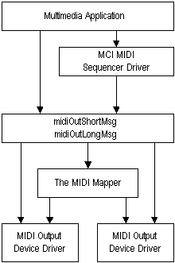

# The MIDI Mapper and Windows

The MIDI Mapper is part of the system software. The following illustration shows how the MIDI Mapper relates to other elements of the audio services.

From the viewpoint of an application, the MIDI Mapper looks like another MIDI output device. The MIDI Mapper receives messages sent to it by the low-level MIDI output functions [**midiOutShortMsg**](/windows/win32/api/mmeapi/nf-mmeapi-midioutshortmsg) and [**midiOutLongMsg**](/windows/win32/api/mmeapi/nf-mmeapi-midioutlongmsg). The MIDI Mapper modifies these messages and redirects them to a MIDI output device according to the current MIDI setup map. The current MIDI setup map is selected by the user by means of the MIDI Control Panel option. Only the user can select the current setup map; applications cannot change the current setup map.

 

 