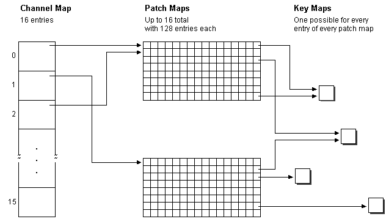

# The MIDI Mapper Architecture

The MIDI Mapper uses a MIDI setup map to determine how to translate and redirect the messages it receives. A MIDI setup map consists of the following types of maps.

-   [The Channel Map](the-channel-map.md)
-   [Patch Maps](patch-maps.md)
-   [Key Maps](key-maps.md)

The following illustration shows the roles of channel, patch, and key maps in a MIDI setup map.

 

 

