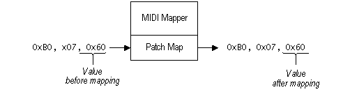

# The Volume Scalar

The purpose of the volume scalar is to allow adjustments between the relative output levels of different patches on a synthesizer. For example, if the bass patch on a synthesizer is too loud compared with its piano patch, you can change the setup map to scale the bass volume down or the piano volume up.

The volume scalar specifies a percentage value for changing all MIDI main-volume controller messages that follow an associated program-change message. For example, if the volume scalar value is 50%, the MIDI Mapper modifies MIDI main-volume controller messages as shown in the following illustration.

 

 

