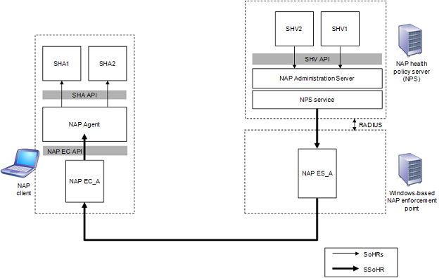

# NAP Client and Server-side Component Communication

> [!Note]  
> The Network Access Protection platform is not available starting with Windows 10

 

The NAP Agent component can communicate with the NAP Administration Server component through the following process:

1.  The NAP Agent passes the SSoH to the NAP EC.
2.  The NAP EC passes the SSoH to the NAP ES.
3.  The NAP ES passes the SSoH to the Network Policy Server (NPS) service.
4.  The NPS service passes the SSoH to the NAP Administration Server.

An SHA can communicate with its corresponding SHV through the following process:

1.  The SHA passes its SoH to the NAP Agent.
2.  The NAP Agent passes the SoH, contained within the SSoH, to the NAP EC.
3.  The NAP EC passes the SoH to the NAP ES.
4.  The NAP ES passes the SoH to the NAP Administration Server.
5.  The NAP Administration Server passes the SoH to the SHV.

The figure below shows the communication process from NAP client components to NAP server-side components.

The NAP Administration Server can communicate with the NAP Agent through the following process:

1.  The NAP Administration Server passes the SoHRs to the NPS service.
2.  The NPS service passes the SSoHR to the NAP ES.
3.  The NAP ES passes the SSoHR to the NAP EC.
4.  The NAP EC passes the SSoHR to the NAP Agent.

The SHV can communicate with its corresponding SHA through the following process:

1.  The SHV passes its SoHR to the NAP Administration Server.
2.  The NAP Administration Server passes the SoHR to the NPS service.
3.  The NPS service passes the SoHR, contained within the SSoHR, to the NAP ES.
4.  The NAP ES passes the SoHR to the NAP EC.
5.  The NAP EC passes the SoHR to the NAP Agent.
6.  The NAP Agent passes the SoHR to the SHA.

The figure below shows the communication process from NAP server-side components to NAP client components.

 

 

