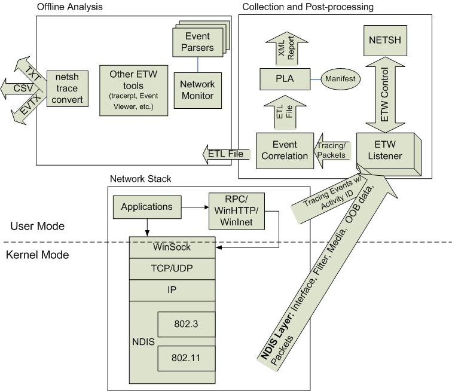

# Network Tracing in Windows 7: Architecture

The illustration below shows the basic network tracing architecture in Windows 7.

Network tracing utilizes the Event Tracing for Windows (ETW) framework available in Windows. Network components (such as Winsock, TCP/IP, NDIS, packet-capture, and so on) register as ETW trace providers and emit events related to network activity. Any recordable activity of significance can be an event logged to ETW. Tracing for these network components and packet captures can be enabled using the **netsh trace** context which acts as an ETW controller.

The generated traces are collected in an Event Trace Log (ETL) file. These ETL files can then be analyzed using a number of tools, such as Network Monitor 3.2 and later, Event Viewer, **netsh trace convert**, or Tracerpt.exe.

Each ETW event has a common header where ETW stores information such as the event properties, time stamps, and activity ID. (For more information about activity IDs, see [Writing Related Events in an End-to-End Scenario](../etw/writing-related-events-in-an-end-to-end-scenario.md)). The activity ID is used to correlate events. In user mode, activity IDs are stored in threads, and all events logged in one thread will automatically be tagged with the same activity ID. In kernel mode, the activity ID must be explicitly passed when an event is logged. By default, ETL files are correlated to group events together under specific activity IDs.

For more information about Windows Events and ETW, see [Windows Events](../events/windows-events.md).

## ETW Components in Network Tracing

Network tracing uses ETW as its primary tracing mechanism to provide information about what the networking subsystems are doing. There are four main components in ETW: event trace sessions, event providers, event controllers and event consumers.

Buffering and logging take place in *event trace sessions*, which accept events from providers and creates trace files.

An *event provider* is a logical entity that writes events to ETW sessions. An event provider can be a user-mode application, a managed application, a driver, or any other software entity. Event providers register with ETW and write events from various points in the code by invoking the ETW logging API. Due to the growing event instrumentation in many operating system components, even a simple application or scenario in Windows will contain several components that are event providers.

An *event controller* starts and stops event trace sessions and enables providers. When an event provider is enabled dynamically by the event controller application, the provider sends events to a specific event trace session designated by the event controller. Each event sent by the event provider to the event trace session consists of a fixed header, which includes event metadata and any additional custom data logged by the provider.

An *event consumer* is an application that reads log files or that listens to an event trace session for real-time events and processes them. One example of an event consumer is Microsoft Network Monitor 3.2, which includes the capability to read and display log files produced by network tracing in Windows 7.

Events are delivered to event consumers in chronological order, and there are various event consumer applications that display the events in specific formats. When an event is logged to a session, ETW adds additional information to the event header, including the timestamp, process and thread ID, processor number, and CPU usage data of the logging thread. This data is then passed on to event consumers, along with any custom data included by the provider.

Providers using the new [Event Logging APIs](/windows/win32/api/evntprov/nf-evntprov-eventwrite) are expected to supply an XML file called the [event manifest](../wes/eventschema-schema.md). This file provides metadata to define all of the custom data and layout information for the events written by the provider. A general purpose consumer application then uses [Trace Data Helper (TDH)](/windows/win32/api/tdh/) APIs to retrieve the event metadata, decode the events, and display them.

With network tracing in Windows 7, the event controller/consumer side includes end-to-end scenario-based tracing support integrated with overall Windows diagnostic and support experiences. A scenario defines a collection of event providers involved in the scenario. The event controller/consumer side defines the scenarios (contexts) where tracing can be used, including the relevant providers for given scenarios across network components. The event provider side includes standardized network tracing events from different components in the network stack, which can be correlated via ETW activity IDs. The providers use a common network schema that standardizes the use of ETW concepts such as keywords, levels, tasks, and opcodes. The schema also defines events that are common for many network components such as error events, packet drop events, schema events, and state transition events.

 

 