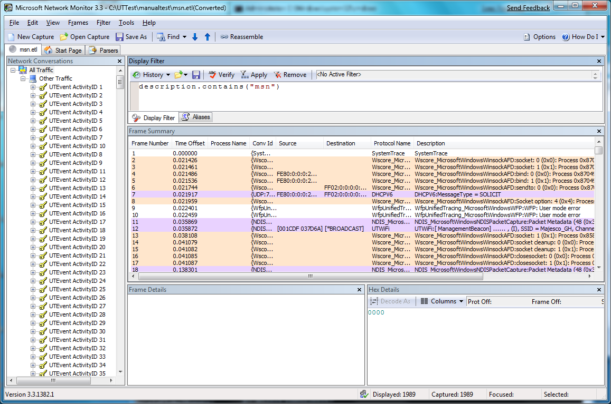
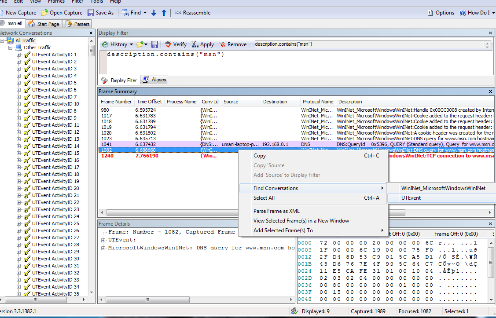
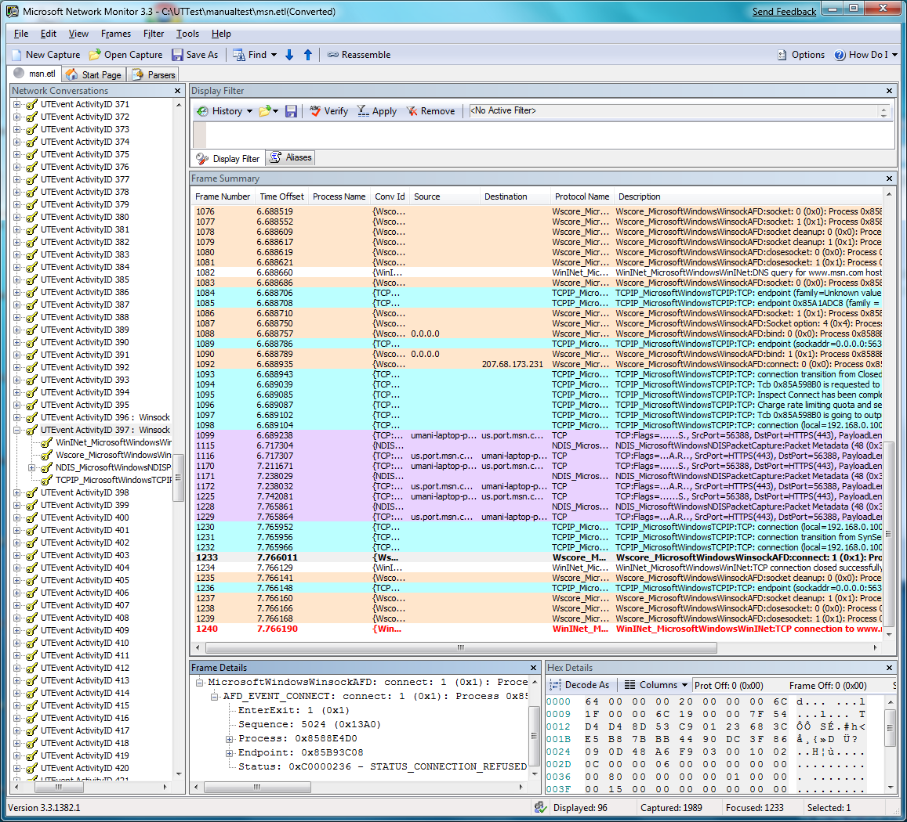

# Troubleshooting Internet Connections

In this scenario, a user is attempting to browse to www.msn.com using the https protocol, but is unable to connect. You can use Netsh and Network Monitor to collect and view traces in order to help determine why the connection failed.

First, you can use netsh to start a trace. Typing **netsh trace start scenario = InternetClient tracefile=msn.etl** starts tracing for all of the providers enabled under the InternetClient scenario, saving the results to a file named msn.etl. After using a web browser to attempt to reach www.msn.com, typing **netsh trace stop** terminates and correlates the trace file.

You can then open the msn.etl file in Network Monitor. The events are grouped by activity ID in the left pane. Using the filter **description.contains("msn")** will show only those events which include the string "msn" in their protocol description.

Next, you can review the events in the frame summary to identify an event which looks relevant. After you select the event, right-click and point to Find Conversations, then click UTEvent to select the conversation at the UTEvent level.

The associated normalized activity in the left pane is then highlighted, in this case UTEvent ActivityID 397.

By using Network Monitor to view and filter the trace information, the number of events to examine has been reduced from 1989 to 96.

 

 

