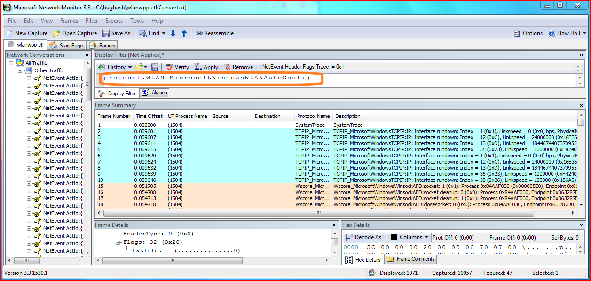
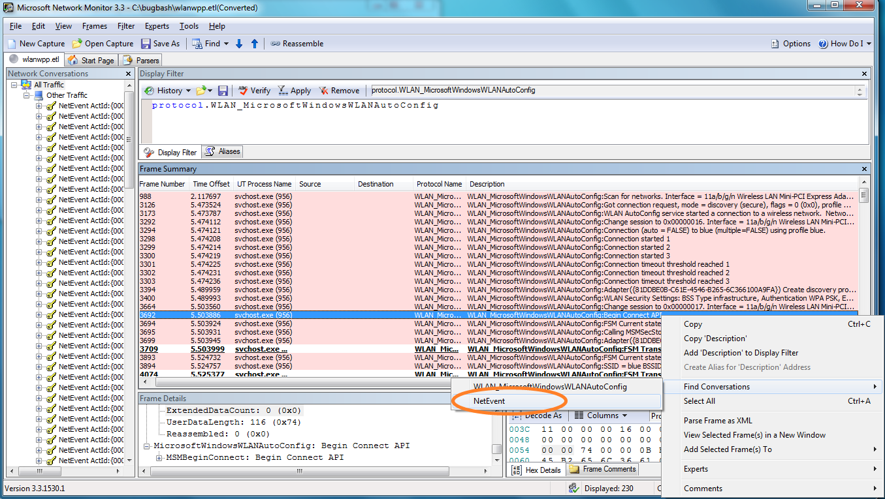
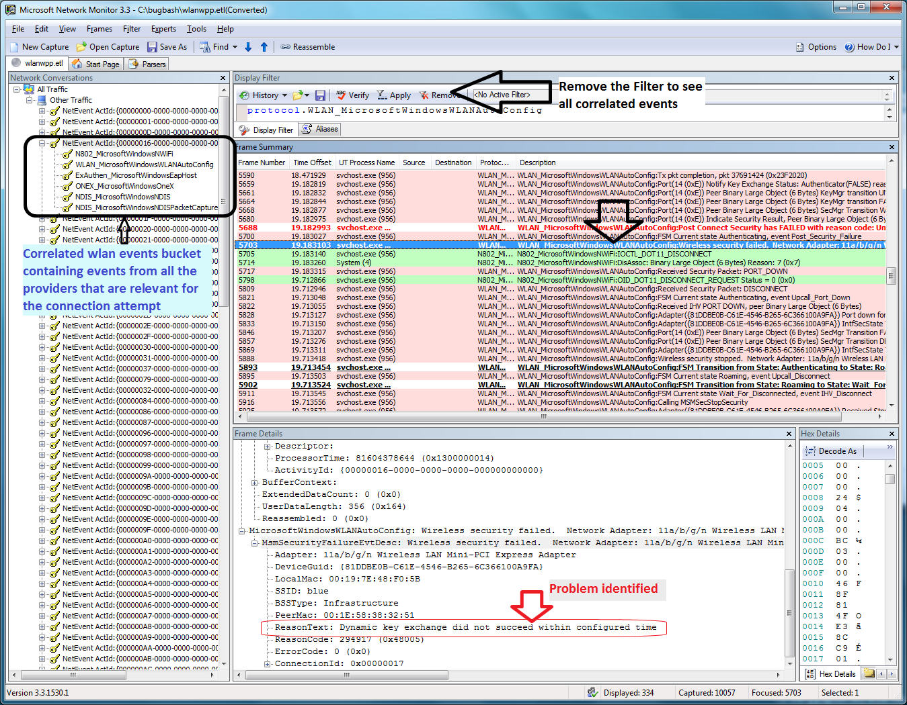

# Troubleshooting Wireless LAN Connections

In this scenario, a user is attempting to connect to a wireless LAN, but is unable to connect. You can use Netsh and Network Monitor to collect and view traces in order to help determine why the connection failed.

First, you can use netsh to start a trace. Typing **netsh trace start scenario = wlan tracefile=wlanwpp.etl** starts tracing for all of the providers enabled under the WLAN scenario, saving the results to a file named wlanwpp.etl. After attempting to connect to the wireless LAN, typing **netsh trace stop** terminates and correlates the trace file.

You can then open the wlanwpp.etl file in Network Monitor. The events are grouped by activity ID in the left pane.

The ETL contains lot of traces from other network providers that are enabled. You can apply a filter to display only those events which are relevant to the **WLAN\_MicrosoftWindowsWlanAutoConfig** provider.

After the filter has been applied, you can review the events in the frame summary to identify an event which looks relevant. After you select the event, right-click and point to Find Conversations, then click NetEvent.

Expanding the items under an activity ID in the left pane will allow you to view all of the other relevant providers for the connection attempt. To view the events from other providers, all filters are removed by clicking **Remove** in the **Display Filter** pane. The traces can be analyzed by scrolling through the frame summary, selecting additional events as needed to gather more information. In this case, the Frame Details pane provides information that the failure is due to key exchange failure, most likely due to the user entering the wrong pass key.

 

 

