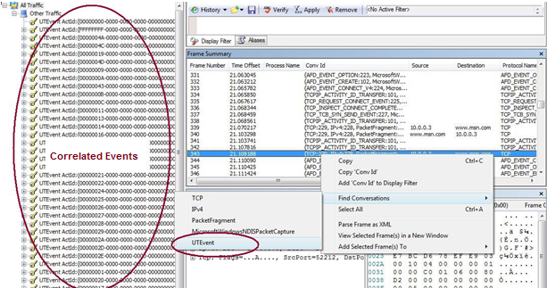
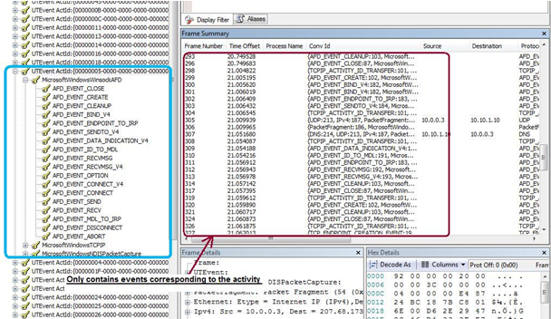
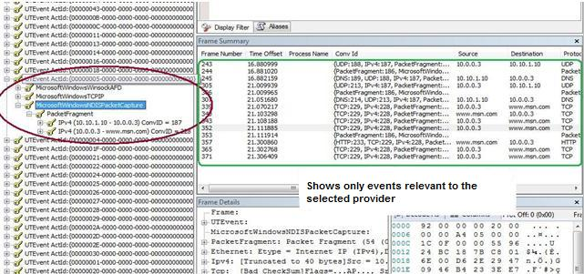
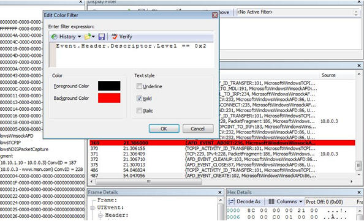
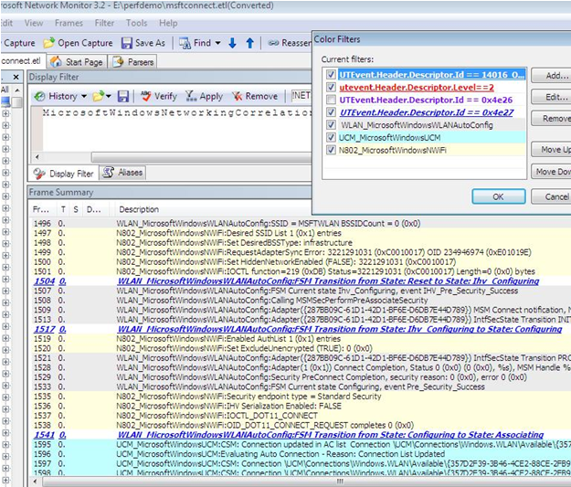

# Using Network Monitor to View ETL Files

[Network Monitor 3.3](https://connect.microsoft.com/site/sitehome.aspx?SiteID=216) enables users to parse, filter, and view an ETL file (using Windows Vista or later). (If using Network Monitor 3.2, you will need to download and install additional parsers from [CodePlex](https://www.codeplex.com/NMParsers) in order to render the network tracing events.)

Correlated ETL files group the relevant events together. The illlustration below shows a correlated file opened in Network Monitor, with conversation enabled.

Correlated events are grouped by activity in the left pane. You can select an event in the Frame Summary pane, then right-click to select the conversation at the network event level. This will display a related activity in the left pane.

Selecting a particular activity from the left pane and expanding it will show the list of providers for the correlated events.

When you select a specific provider in the left pane, a list of events specific to that provider and activity will be displayed in the Frame Summary pane.

Filters can be applied in Network Monitor to make it easier to view and find the right events or packet. For example, you can apply a filter to selected error events (for example, **UTEvent.Header.Descriptor.Level == 2**) to display them in a certain color.

Filters can also be applied to mark different providers in different colors so that the results are easier to view.

To apply a filter, click **ColorFilters** on the **Filters** menu.

The following table shows some examples of useful filters.

| Filter                                                                        | Description                                                       |
|-------------------------------------------------------------------------------|-------------------------------------------------------------------|
| UTEvent.Header.Descriptor.Level == 2                                          | Filters only error events.                                        |
| UTEvent.Header.Descriptor.Level == 3                                          | Filters only warning events.                                      |
| UTEvent.Header.Descriptor.Id == 2001                                          | Filters only events with event ID 2001.                           |
| WLAN\_MicrosoftWindowsWLANAutoConfig                                          | Filters only events from WLAN service.                            |
| N802\_MicrosoftWindowsNWiFi                                                   | Filters only events from the Native Wifi driver.                  |
| WLAN\_MicrosoftWindowsWLANAutoConfig AND UTEvent.Header.Descriptor.Id == 2001 | Filters only events with event ID 2001 emitted from WLAN service. |

 

 

 

