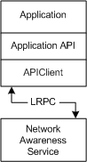

# Network List Manager Architecture

Network List Manager runs as a service in the context of Svchost.exe and is started during the computer boot procedure. The Network List Manager service maintains a table of available networks and network attributes that are retrieved by applications through the Network List Manager API. Network List Manager provides basic functions to filter and query the Network List Manager service for specific networks and retrieve the attributes of these networks. The following diagram shows the Network List Manager architecture and the interaction between the Network List Manager service and the client application.

 

 

