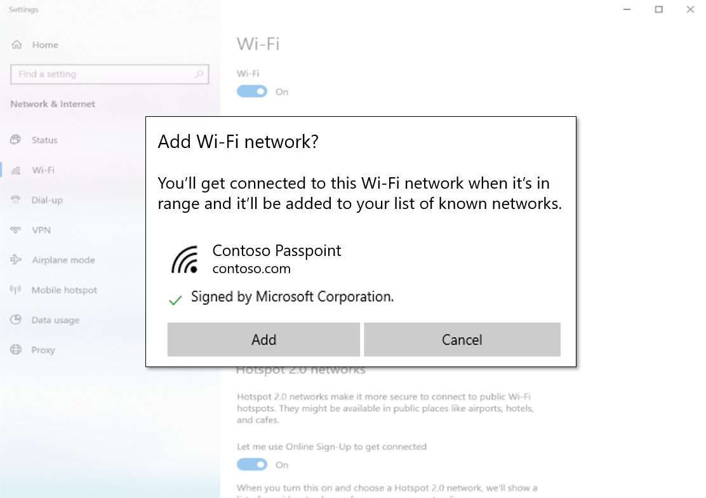

# Provision a Wi-Fi profile via a website

The workflow described in this topic was introduced in Windows 10, version 2004. This topic shows how to configure a website so that a user can provision a profile for a Passpoint network (or for a normal network) prior to moving into range of the corresponding Wi-Fi access points. An example scenario is that of a user who might be planning to visit an airport or a conference for the first time, and they want to prepare in advance by downloading and provisioning a profile at home.

As a developer, you enable the workflow by providing an XML profile, and configuring a website. Your users can then provision a Wi-Fi profile by downloading it from your website via a web browser. On the user's device, the Wi-Fi profile is then provisioned by using URI activation and the Windows **Settings** app.

This workflow supersedes the mechanism in Internet Explorer for provisioning Wi-Fi profiles, which relies on Microsoft-specific JavaScript APIs. This new workflow is expected to work with all major browsers.

## The workflow in more detail

You can activate this workflow from a hyperlink that includes as an argument the download URI of the provisioning XML document.

```xml
ms-settings:wifi-provisioning?uri={download_uri}
```

For example, the following HTML markup gives a link to install the profile(s) that are found in a hypothetical document `http://contoso.com/ProvisioningDoc.xml`.

```html
<a href="ms-settings:wifi-provisioning?uri=http://contoso.com/ProvisioningDoc.xml">Install</a>
```

Your XML must adhere to the provisioning schema (see [Account provisioning](/windows-hardware/drivers/mobilebroadband/account-provisioning)). Your XML must also include one or more [WLANProfile](./wlan-profileschema-wlanprofile-element.md) elements. Each profile will be displayed in the **Add** dialog described next.

When the user clicks your HTML link, the installation workflow is invoked in the **Settings** app. Your provisioning XML document is downloaded by the **Settings** app. Once it's downloaded, information about the profiles, signature, and signer are displayed (provided that the document adheres to the schema).



The **Add** button in the dialog in the **Settings** app is enabled only if the provisioning file is signed and trusted.

## In your web page, determine whether this workflow is supported

There is no way in JavaScript to determine the exact build version of Windows. But if your user is using the Microsoft Edge web browser, then you can determine the version of Edge by inspecting the value of the `User-agent` HTTP header. If the version is greater than or equal to `18.nnnnn`, then the workflow is supported.

## Related topics

* [Account provisioning](/windows-hardware/drivers/mobilebroadband/account-provisioning)
* [WLANProfile element](./wlan-profileschema-wlanprofile-element.md)