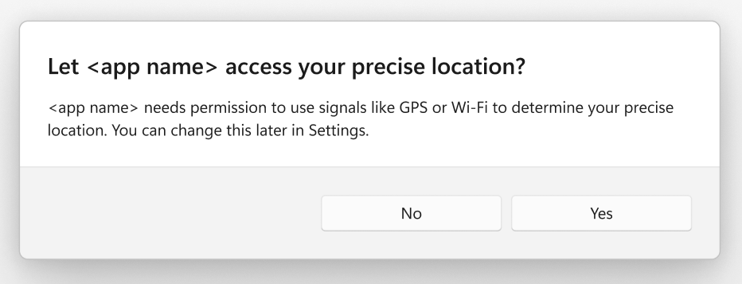
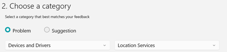

# Changes to API behavior for Wi-Fi access and location

> [!NOTE]
> **Some information relates to pre-released product, which may be substantially modified before it's commercially released. Microsoft makes no warranties, express or implied, with respect to the information provided here.**

> [!IMPORTANT]
> The feature described in this topic is available in pre-release versions of the [Windows Insider Preview](https://www.microsoft.com/software-download/windowsinsiderpreviewSDK).

## A summary of the changes

In order to better manage which apps have access to location, Windows is planning to add new privacy controls.

Currently, an app can view the Wi-Fi networks to be found in the vicinity of the device running the app, and use those networks to determine the precise location of the device. But going forward, access to APIs that provide the necessary Basic Service Set Identifiers (BSSIDs) will be restricted to only those apps that the user has configured as being allowed to access the user's precise location. That consent to use the Location service is configured in Windows **Settings** > **Privacy & security** > **Location**. It can be set at the device level, the user level, or the individual app level. After this change is implemented, if the user hasn't given the required consent, then the system will trigger a one-time prompt the first time that an app is blocked.

Here's an example of the system prompt:

If you have an app that calls Wi-Fi APIs in either [wlanapi.h](/windows/win32/api/wlanapi/) or the [Windows.Devices.WiFi](/uwp/api/windows.devices.wifi) namespace, or [NetworkInformation](/uwp/api/windows.networking.connectivity.networkinformation), or [Geolocator](/uwp/api/windows.devices.geolocation.geolocator), then this topic is for you. It details how you can optimize your app's behavior to improve the user experience.

## When will the changes take place?

The changes will take place initially in a [Windows Insider Preview](https://www.microsoft.com/software-download/windowsinsiderpreviewiso) release, and then later in a Windows feature release (a commercial release).

* In a Windows Insider Preview release, the changes will first take effect in October 2023.
* You'll then have until the following Windows feature release in fall of 2024 to test your app's scenarios, and to make any necessary changes. After that date, Windows devices will begin getting the update that contains the behavior change described above.

As mentioned, even the details in this document might change before the feature is commercially released.

## How can you prepare for the changes?

There are several API surfaces impacted by this change. And, as we'll describe in a moment, some APIs will begin returning "access denied" codes under certain conditions. So we recommend that you test your app in order to ensure that everything is behaving as expected once your app starts receiving those "access denied" return values on your users' machines.

In short, we encourage you as an app developer to make the following changes to your app's code. These changes will help your users (when necessary) to grant your app access to the user's precise location; and to improve the user-experience:

1. Don't make a Wi-Fi scan call within your app unless strictly necessary.
1. If you're using a Wi-Fi scan for location purposes, then replace that scan with a Location API call.
1. Take control of when the system prompt appears so that the prompt is displayed alongside your in-app scenarios.
1. Build into your app prompts that let the user know that they need to adjust Windows **Settings** in order to grant access.

## Which APIs will be affected?

Your app will be affected if it calls any of these APIs:

* Win32 APIs in the [wlanapi.h header](/windows/win32/api/wlanapi/) that involve BSSID.
* Windows Runtime (WinRT) APIs in the [Windows.Devices.WiFi namespace](/uwp/api/windows.devices.wifi).
* The WinRT method [Windows.Networking.Connectivity.NetworkInformation.GetLanIdentifiers](/uwp/api/windows.networking.connectivity.networkinformation.getlanidentifiers).
* The WinRT method [Windows.Devices.Geolocation.Geolocator.RequestAccessAsync](/uwp/api/windows.devices.geolocation.geolocator.requestaccessasync).
* Also, requesting the **wiFiControl** device capability will require consent from the user regarding access to location. See [App capability declarations](/windows/uwp/packaging/app-capability-declarations).

## The Wi-Fi APIs in either Win32's wlanapi.h or in WinRT's Windows.Devices.WiFi

* If the user hasn't given your app consent to precise location access, then the first time your app calls an affected API, a one-time-per-app system prompt will be displayed. Depending on how your app calls those APIs, the prompt could manifest in different ways in your app's user interface.
* If the user hasn't given consent to precise location access, then the following Win32 APIs in the [wlanapi.h header](/windows/win32/api/wlanapi/) will return **ERROR_ACCESS_DENIED**:
  * [WlanGetAvailableNetworkList](/windows/win32/api/wlanapi/nf-wlanapi-wlangetavailablenetworklist)
  * [WlanGetNetworkBssList](/windows/win32/api/wlanapi/nf-wlanapi-wlangetnetworkbsslist)
  * [WlanQueryInterface](/windows/win32/api/wlanapi/nf-wlanapi-wlanqueryinterface) (if the argument of *OpCode* is **wlan_intf_opcode_current_connection**)
  * [WlanScan](/windows/win32/api/wlanapi/nf-wlanapi-wlanscan)
* If the user hasn't given consent to precise location access, then the [Windows.Devices.WiFi.WiFiAdapter.RequestAccessAsync](/uwp/api/windows.devices.wifi.wifiadapter.requestaccessasync) API will return **DeniedBySystem**. And other APIs in the [Windows.Devices.WiFi namespace](/uwp/api/windows.devices.wifi) Windows.Devices.WiFi namespace will throw an "Access is denied" exception.
* Calls to these APIs will appear in the in-use system tray and location recent activity.

[WlanRegisterNotification](/windows/win32/api/wlanapi/nf-wlanapi-wlanregisternotification) is also affected, depending on the arguments that you pass to it. If the **WLAN_NOTIFICATION_SOURCE_MSM** flag is set in *dwNotifSource*, then the **wiFiControl** device capability is required (see [App capability declarations](/windows/uwp/packaging/app-capability-declarations)). If that capability is not granted, then the function returns **ERROR_ACCESS_DENIED**. Requesting the **wiFiControl** device capability will require consent from the user regarding access to location.

### Action needed for the Wi-Fi APIs

To create a better experience for your app's users, and to ensure smooth operation, you should make the following changes to your app's behavior in order to control when system prompts are shown:

* If your app needs to know the host device's location, then it should call the Geolocation APIs, rather than use a Wi-Fi scan.
* In order to cause the one-time-per-app system prompt to be displayed at a suitable point in the user-experience, your app should call [WiFiAdapter.RequestAccessAsync](/uwp/api/windows.devices.wifi.wifiadapter.requestaccessasync). The call should align to a user action that requires Wi-Fi or location (resulting in higher consent rates than prompting the user immediately after installation).
* Your app can query its location access status by using the [AppCapability.CheckAccess](/uwp/api/windows.security.authorization.appcapabilityaccess.appcapability.checkaccess) API with the **wiFiControl** device capability. If the following access will trigger a dialog, then the API will return [AppCapabilityAccessStatus.UserPromptRequired](/uwp/api/windows.security.authorization.appcapabilityaccess.appcapabilityaccessstatus).
* In order to be notified and respond accordingly whenever the user changes location consent, your app should subscribe to the [AppCapability.AccessChanged](/uwp/api/windows.security.authorization.appcapabilityaccess.appcapability.accesschanged) event.
* You should add an in-app app experience for the access-denied scenario. In that scenario, your app should redirect users to Windows **Settings** so that the user can allow your app to access their precise location. You can do that by passing the string "ms-settings:privacy-location" to the [Launcher.LaunchUriAsync](/uwp/api/windows.system.launcher.launchuriasync) method.
* Your app should throttle requests to reasonable levels, so that the location-in-use icon doesn't appear in the system tray frequently.

## The WinRT NetworkInformation.GetLanIdentifiers method

* If the user hasn't given consent to precise location access, then the [Windows.Networking.Connectivity.NetworkInformation.GetLanIdentifiers](/uwp/api/windows.networking.connectivity.networkinformation.getlanidentifiers) API won't return WLAN-related information.
* Calls to this API will appear in the in-use system tray and location recent activity.

### Action needed for NetworkInformation

In the same way as described above for the Wi-Fi APIs, your app should request/query access, monitor for changes, and direct users to **Settings**.

## The WinRT Geolocator.RequestAccessAsync method

* If the user hasn't given consent to precise location access, then the first time [Windows.Devices.Geolocation.Geolocator.RequestAccessAsync](/uwp/api/windows.devices.geolocation.geolocator.requestaccessasync) is called, a one-time-per-app system prompt will be displayed.

### Action needed for Geolocation

To create a better experience for your app's users, and to ensure smooth operation, you should make the following changes to your app's behavior in order to control when system prompts are shown:

* In order to cause the one-time-per-app system prompt to be displayed at a suitable point in the user-experience, your app should call [Geolocator.RequestAccessAsync](/uwp/api/windows.devices.geolocation.geolocator.requestaccessasync). The call should typically align to a user action that requires precise location (resulting in higher consent rates than prompting the user immediately after installation).
* In order to be notified and respond accordingly whenever the user changes location consent, your app should subscribe to the [Geolocator.StatusChangedevent](/uwp/api/windows.devices.geolocation.geolocator.statuschanged) event, and retrieve location permission status from the [StatusChangedEventArgs.Status](/uwp/api/windows.devices.geolocation.statuschangedeventargs.status) property.
* You should add an in-app app experience for the access-denied scenario. In that scenario, your app should redirect users to Windows **Settings** so that the user can allow your app to access their precise location. You can do that by passing the string "ms-settings:privacy-location" to the [Launcher.LaunchUriAsync](/uwp/api/windows.system.launcher.launchuriasync) method.

## How to test your app

1. Use a Windows PC that's enrolled in the [Windows Insider Program](https://www.microsoft.com/windowsinsider/). It should be on the Canary channel, build 25976 or higher.
1. Turn off Location services in Windows **Settings** > **Privacy & security** > **Location**.
1. Run your app that uses location or Wi-Fi information.
1. The expected result is that you see a system prompt prompting you for location consent.

## How to give feedback

We appreciate your continued support and feedback. Please submit any bug reports through the [Feedback Hub app](/windows-insider/feedback-hub/feedback-hub-app), and indicate your app or other details in the description. The category is **Devices and Drivers** > **Location Services**.

