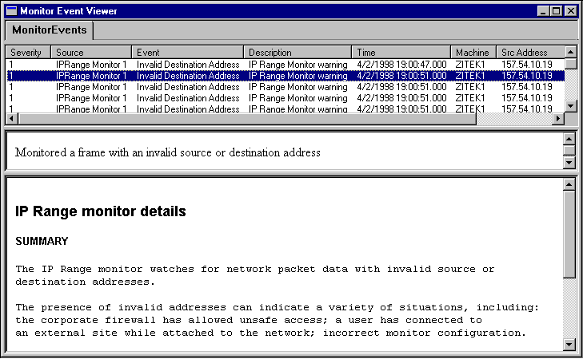

# About Event Reference Pages

An event reference page (ERP) is an HTML document that provides Network Monitor information about events detected during expert or monitor operation.

You can view ERPs in the Event Viewer of Network Monitor, Monitor Control Tool, or in any browser that supports the HTML features of Microsoft Internet Explorer Version 4.01 or later. That is, you can add supported controls or scripted languages into your ERP.

However, ERPs appear only if the expert designates the HTML document by name. When properly designated, the ERP appears in the lower pane when the event in the Event Viewer is selected. The figure below shows an ERP associated with the Internet Protocol (IP) Range monitor.

## Expert Events

Expert events are identified by the **EventIdent** member of an [**NMEVENTDATA**](nmeventdata.md) structure. When you write an expert you determine the **EventIdent** values, which are typically numbered 1, 2, 3, and so on. For example, suppose that an expert generates two events (**EventIdent1** and **EventIdent2**). If you want the Event Viewer to display the events separately, you must create two separate ERP documents.

 

 

