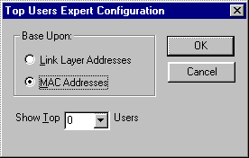

# Configuring Experts

To configure experts, use the custom dialog boxes and the [**Configure**](configure.md) function. When you write Network monitor experts, you have a choice. You can create a set of default configuration items that can be used when the expert initially runs, or you can allow Network Monitor users to configure the expert at run time. Configurations for each expert are stored by Network Monitor. As an option, users can reset the expert configuration back to original default settings. Be aware that you can bypass the use of **Configure** by developing an expert that passes a fixed configuration to Network Monitor.

 

 

