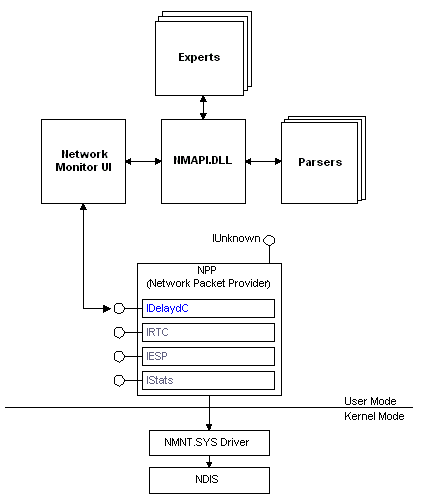

# Expert and Parser Architecture

The following figure shows the relationship between [expert](experts.md) and [parser](parsers.md) applications and other components of the Network Monitor architecture.

The network traffic is collected, as individual frames, from the NDIS driver. The Network Monitor driver (Nmnt.sys) then routes the frames to a network packet provider (NPP), which captures the data and places it in one or more capture files. The NPP is a collection of COM interfaces used to capture data. In this case, the [**IDelaydC**](idelaydc.md) interface is used to perform a delayed capture.

> [!Note]  
> The NPP is used for delayed and real-time captures. For real-time captures, the [**IRTC**](irtc.md) interface is used.

 

When the network frames are stored in the capture file and the file is accessible, experts and parsers can use the Network Monitor UI and the Network Monitor functions provided in Nmapi.dll to analyze the data. Capture files are not accessible until the capture is complete.

 

 

