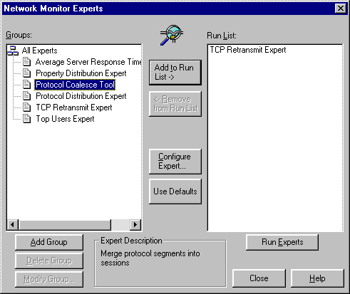

# Expert

An expert is a Microsoft Win32 dynamic-link library (DLL) that analyzes network traffic collected by a [*network packet provider*](n.md) (NPP), and placed in a capture file. After the data is captured and stored in a capture file, the expert works with a parser, also referred to as a protocol parser, to analyze the data in the file. For example, you can examine the frames of the capture file and use a [*parser*](p.md) to recognize protocols such as server message block (SMB), or Transmission Control Protocol/Internet Protocol (TCP/IP).

You can design an expert to work with all of the Network Monitor parsers, and any parsers that you create yourself.

After a requested match of protocols identifies a specific frame, the expert extracts data from the frame. You can program the expert to manipulate information into usable data that the Network Monitor Event Viewer displays.

You can configure an expert at run time, and then use Network Monitor to save user configuration data for reuse with different capture files. You can use an expert to provide correlation data and custom resolutions for end users. For more information about the creation of HTML-based configuration information, see [Event Reference Page](event-reference-page.md).

During Network Monitor setup, the following expert DLLs are installed in the Experts sub-directory:

-   Coalesce.dll
-   Propdist.dll
-   Protdist.dll
-   Resptime.dll
-   Tcpipe.dll
-   Topuser.dll

When you start Network Monitor, the [**DllMain**](dllmain-expert.md) function builds all experts in the experts subdirectory. When the user selects **Experts** on the **Tools** menu of the Network Monitor UI, Network Monitor loads the expert DLLs. The expert is called through the [Register Expert](register-expert.md) entry point to provide basic details about the expert.

Network Monitor calls the following functions to manage the expert:

-   [**DllMain**](dllmain-expert.md)
-   [**Register Expert**](register-expert.md)
-   [**Run**](run.md)
-   [**Configure**](configure.md)

The expert must implement each of the preceding functions.

 

 

