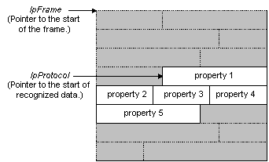

# Implementing AttachProperties

Network Monitor calls the [**AttachProperties**](attachproperties.md) function to map the properties that exist in a piece of recognized data. The [**AttachProperties**](attachproperties.md) function maps the properties to a specific location.

Network Monitor uses the following process to parse the data in a frame.

-   First, Network Monitor calls [RecognizeFrame](recognizeframe.md) to recognize all the protocols that exist in a frame.
-   Then, Network Monitor calls [**AttachProperties**](attachproperties.md) for each parser that recognizes a piece of data.

When Network Monitor calls the [AttachProperties](attachproperties.md) function for the recognized data, the parser that is called must parse the data, and then map each existing property to a location in the recognized data. The parser determines which properties exist, and where each property is located in the data. The following figure shows parser-recognized data.



During the implementation of [**AttachProperties**](attachproperties.md), you must call one of the following functions for each property that exists in a data frame.

-   Call the [**AttachPropertyInstanceEx**](attachpropertyinstanceex.md) function when you want to modify the property data in a frame.
-   Call the [**AttachPropertyInstance**](attachpropertyinstance.md) function when you do not want to modify the property data in a frame.

> [!Note]  
> It is recommended that you use the data as it exists in the capture.

 

The following procedure identifies the steps necessary to implement [**AttachProperties**](attachproperties.md).

**To implement AttachProperties**

1.  Determine which properties exist, and the property location in the data.
2.  Call [**AttachPropertyInstanceEx**](attachpropertyinstanceex.md) for each property with a value that you want to modify.
3.  Call [**AttachPropertyInstance**](attachpropertyinstance.md) for each property with a value that you do not want to modify. Typically, this is the only function that you need to call.

The following is a basic implementation of [**AttachProperties**](attachproperties.md). Be aware that the example does not include either the code to determine which properties exist, or the code to locate the properties.

``` syntax
#include <windows.h>

LPBYTE BHAPI MyProtocolAttachProperties( HFRAME   hFrame,
                                         LPBYTE   pMacFrame,
                                         LPBYTE   pBLRPLATEFrame,
                                         DWORD    MacType,
                                         DWORD    BytesLeft,
                                         HPROTOCOL  hPreviousProtocol,
                                         DWORD    nPrevProtocolOffset,
                                         DWORD    InstData)
{
  PBLRPLATEHDR pBLRPLATEHdr = (PBLRPLATEHDR)pBLRPLATEFrame;

  // Attach summary property.
  AttachPropertyInstance( hFrame,
                          BLRPLATEPropertyTable[BLRPLATE_SUMMARY].hProperty,
                          (WORD)BytesLeft,
                          (LPBYTE)pBLRPLATEFrame,
                          0,        // No Help file.
                          0,        // Indent level.
                          0);      // Data flag.

  // Attach signature property.
  AttachPropertyInstance( hFrame,
                          BLRPLATEPropertyTable[BLRPLATE_SIGNATURE].hProperty,
                          sizeof(DWORD),
                          &(pBLRPLATEHdr->Signature),
                          0,        // No Help file.
                          1,        // Indent level.
                          0);        // Data flag.


  // Attach opcode.
  AttachPropertyInstance( hFrame,
                          BLRPLATEPropertyTable[BLRPLATE_OPCODE].hProperty,
                          sizeof(WORD),
                          &(pBLRPLATEHdr->Opcode),
                          0,        // No Help file.
                          1,        // Indent level.
                          0);        // Data flag.

  // Attach flags summary.
  AttachPropertyInstance( hFrame,
                          BLRPLATEPropertyTable[BLRPLATE_FLAGS_SUMMARY].hProperty,
                          sizeof(BYTE),
                          &(pBLRPLATEHdr->Flags),
                          0,        // No Help file.
                          1,        // Indent level.
                          0);       // Data flag.

// Attach flags decode.
  AttachPropertyInstance( hFrame,
                          BLRPLATEPropertyTable[BLRPLATE_FLAGS_FLAGS].hProperty,
                          sizeof(BYTE),
                          &(pBLRPLATEHdr->Flags),
                          0,        // No Help file.
                          2,        // Indent level.
                          0);       // Data flag.

  RETURN null;

}
```

 

 


