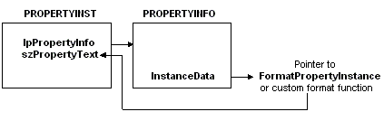

# Implementing FormatProperties

Network Monitor calls the [**FormatProperties**](formatproperties.md) function to format the data that is displayed in the details pane of the Network Monitor UI. Typically, **FormatProperties** is called to format the summary line for a protocol, and then to format all the property instances of the protocol within a frame. However, Network Monitor does not identify the number of times that **FormatProperties** is called for a specific parser.

When calling [**FormatProperties**](formatproperties.md), Network Monitor provides a [**PROPERTYINST**](propertyinst.md) structure for each property that it displays. The **PROPERTYINST** structure provides information about the data to be displayed, including a pointer to the [**PROPERTYINFO**](propertyinfo.md) structure that specifies the function to use to format the displayed data property.

> [!Note]  
> A [**PROPERTYINFO**](propertyinfo.md) structure is specified when adding a property to the [*property database*](p.md) of the parser.

 

Network Monitor identifies the format function to call for each property instance. The **InstanceData** member of the [**PROPERTYINFO**](propertyinfo.md) structure can specify the following:

-   The [**FormatPropertyInstance**](formatpropertyinstance.md) function to use the [*generic formatter*](g.md) that Network Monitor provides.

    – or –

-   The name of a custom format function that the parser provides.

The [**FormatPropertyInstance**](formatpropertyinstance.md) and the custom format functions return the formatted data that is displayed in the details pane of the Network Monitor UI.

The following illustration shows how Network Monitor identifies the function to call for each property instance.



The following procedure identifies the steps necessary to implement [**FormatProperties**](formatproperties.md).

**To implement FormatProperties**

-   Using a loop structure, call the format function for each [**PROPERTYINST**](propertyinst.md) structure that is passed to the parser in the *lpPropInst* parameter of the [**FormatProperties**](formatproperties.md) function.

The following is a basic implementation of [**FormatProperties**](formatproperties.md).

``` syntax
#include <windows.h>

DWORD BHAPI MyProtocolFormatProperties( HFRAME hFrame,
                                        LPBYTE         pMacFrame,
                                        LPBYTE         pBLRPLATEFrame,
                                        DWORD          nPropertyInsts
                                        LPPROPERTYINST  p)
  {
    while( nPropertyInsts-- > 0)
      {
         ( (FORMAT) p->lpPropertyInfo->InstanceData) ) (p);
         p++;
      }
  return BHERR_SUCCESS;
  }
```

 

 


