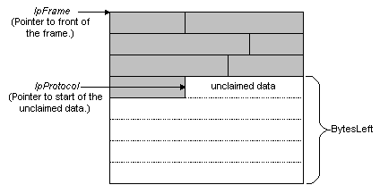

# Implementing RecognizeFrame

Network Monitors calls the [**RecognizeFrame**](recognizeframe.md) function of a parser to determine that the parser recognizes the unclaimed data of a frame. The unclaimed data may be at the start of a frame, but typically, unclaimed data is located in the middle of a frame. The following illustration shows unclaimed data located in the middle of a frame.



Network Monitor provides the following information when it calls the [**RecognizeFrame**](recognizeframe.md) function:

-   A handle to the frame.
-   A pointer to the start of the frame.
-   A pointer to the start of the unclaimed data.
-   The MAC value of the first protocol in the frame.
-   The number of bytes in the unclaimed data; that is, the bytes remaining in the frame.
-   A handle to the previous protocol.
-   The offset of the previous protocol.

When the parser DLL determines that unclaimed data starts with the parser protocol, the parser DLL determines where the next protocol starts, and which protocol follows. The parser DLL functions in the following conditional ways:

-   If the parser DLL recognizes unclaimed data, the parser DLL sets the *pProtocolStatus* parameter, and returns a pointer to either the next protocol in the frame, or **NULL**. **NULL** is returned if the current protocol is the last protocol in the frame.
-   If the parser DLL recognizes unclaimed data and identifies the protocol that follows (from information provided in the protocol), then the parser DLL returns a pointer to the handle of the next protocol in the *phNextProtocol* parameter of the function.
-   If the parser DLL does not recognize unclaimed data, the parser DLL returns the pointer to the start of unclaimed data, and Network Monitor continues trying to parse the unclaimed data.

**To implement RecognizeFrame**

1.  Test to determine that you recognize the protocol.
2.  If you recognize unclaimed data and you know which protocol follows, set *pProtocolStatus* to PROTOCOL\_STATUS\_NEXT\_PROTOCOL, set *phNextProtocol* to a pointer that points to the handle for the next protocol, and then return a pointer to the next protocol.

    –or–

    If you recognize unclaimed data and you do not know which protocol follows, set *pProtocolStatus* to PROTOCOL\_STATUS\_RECOGNIZED, and then return a pointer to the next protocol.

    –or–

    If you recognize unclaimed data and your protocol is the last protocol in a frame, set *pProtocolStatus* to PROTOCOL\_STATUS\_CLAIMED, and then return **NULL**.

    –or–

    If you do not recognize unclaimed data, set *pProtocolStatus* to PROTOCOL\_STATUS\_NOT\_RECOGNIZED, and then return the pointer that is passed to you in *pProtocol*.

The following is a basic implementation of [**RecognizeFrame**](recognizeframe.md).

``` syntax
#include <windows.h>

LPBYTE BHAPI MyProtocol_RecognizeFrame( HFRAME hFrame,
                                        LPBYTE        pMacFrame,
                                        LPBYTE        pProtocol,
                                        DWORD         MacType,
                                        DWORD         BytesLeft,
                                        HPROTOCOL     hPrevProtocol,
                                        DWORD         nPreviuosProtOffset,
                                        LPDWORD       pProtocolStatus,
                                        LPHPROTOCOL   phNextProtocol,
                                        LPDWORD       InstData)
  
  // Test unclaimed data. 
  
  // If unclaimed data is recognized, but you do not know what follows.
  *pProtocolStatus =  PROTOCOL_STATUS_RECOGNIZED;
  return pProtocol + MY_PROTOCOL_LENGTH;
  
  // If unclaimed data is recognized and you know what follows.
  *pProtocolStatus =  PROTOCOL_STATUS_NEXT_PROTOCOL;
  phNextProtocol = GetProtocolFromTable(
                                        hTable,
                                        ItemToFind,
                                        lpInstData);
  return  pProtocol + MY_PROTOCOL_LENGTH;
  
  // If unclaimed data is recognized and the protocol is the last 
  // protocol in the frame.
  *pProtocolStatus =  PROTOCOL_STATUS_CLAIMED;
  return NULL;
  
  // If the unclaimed data is not recognized.
  *pProtocolStatus =  PROTOCOL_STATUS_NOT_RECOGNIZED;
  return *pProtocol;

}
```

 

 


