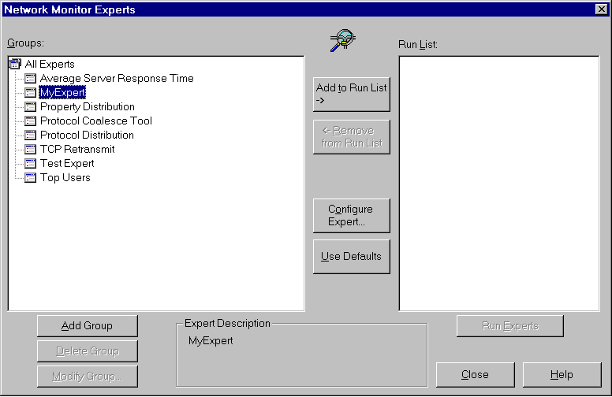

# Installing an Expert to Network Monitor 2.1

To install an expert DLL, copy it to the Network Monitor\\Experts subdirectory (for example, C:\\Program Files\\NetMon2\\Experts). After installation, the expert will be recognized and available the next time Network Monitor starts.

The following illustration shows MyExpert DLL, MyExpert built from the sample code and copied to the \\Experts subdirectory.

 

 

