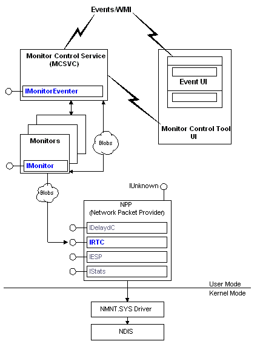

# Monitor Architecture

The following figure shows the relationship between [*monitors*](m.md) and other components of the Network Monitor architecture.

The network traffic is collected (as individual frames) from the NDIS driver. The Network Monitor driver (Nmnt.sys) then routes the frames to a network packet provider (NPP), which in turn captures the data in real-time mode. The NPP is a collection of COM interfaces used to capture data. In this case, the [**IRTC**](irtc.md) interface is used to perform a real-time capture.

> [!Note]  
> The NPP is used for delayed and real-time captures. For delayed captures used by experts and parsers, the [**IDelaydC**](idelaydc.md) interface is used.

 

The monitor then examines the captured data in real-time mode, detecting specific network conditions and generating events as required.

Three other components are used by monitor applications: the Monitor Control Tool, the Monitor Control Service (MCSVC), and the Event Viewer:

-   The Monitor Control Tool is used to manage your monitor applications. This includes configuring and running all your monitor applications.
-   The Monitor Control Service (MCSVC) fires events, provides a communications link to WMI for event viewing, and coordinates the processing of monitor operations.
-   The Event Viewer displays the events fired by the Monitor Control Service.

## Related topics

<dl> <dt>

[**IMonitor**](imonitor.md)
</dt> <dt>

[**IMonitorEventer**](imonitoreventer.md)
</dt> <dt>

[**IRTC**](irtc.md)
</dt> </dl>

 

 

